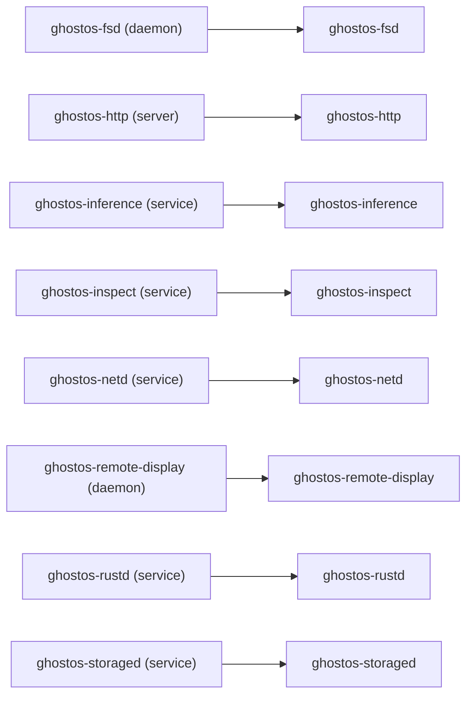

<!-- Generated by scripts/generate-inventory-diagrams.py. -->
<!-- Do not edit this file; update Cargo manifests or Rust source metadata. -->

# GhostOS source inventory diagrams

This file is generated from workspace Cargo metadata, Rust declarations, and test source files.
It has no hand-maintained inventory list. Run `python3 scripts/generate-inventory-diagrams.py` after source changes; local validation uses `--check` to reject stale output.

| Inventory | Entries | Source metadata |
| --- | ---: | --- |
| Crates | 63 | Cargo workspace packages and path dependencies |
| Services | 8 | service.rs, daemon.rs, server.rs, and *_SERVICE_NAME constants |
| Protocols | 20 | protocol modules, protocol/schema version constants, and traffic enums |
| Capabilities | 28 | capability/rights enums, structs, and associated constants |
| Storage formats | 35 | SYN* magic literals and nearby format/version constants |
| Test files | 137 | Rust tests/ files and source files with #[test] functions |

## Crates

```mermaid
graph LR
    crate_cargo_ghostos["cargo-ghostos"]
    crate_ghostos_script["ghostos-script"]
    crate_ghostos_shell["ghostos-shell"]
    crate_ghostos_actors["ghostos-actors"]
    crate_ghostos_agent_bridge["Native capability-scoped AI agent script execution for GhostOS"]
    crate_ghostos_agentd["Capability-scoped semantic memory and context bus for GhostOS agents"]
    crate_ghostos_app["ghostos-app"]
    crate_ghostos_auditd["Bounded background package security auditing for GhostOS"]
    crate_ghostos_auth["ghostos-auth"]
    crate_ghostos_backup["ghostos-backup"]
    crate_ghostos_balancerd["Active-active actor compute placement and cache-aware lease coordination"]
    crate_ghostos_boot_protocol["ghostos-boot-protocol"]
    crate_ghostos_client_sdk["Portable GhostOS capability and frontend RPC client SDK"]
    crate_ghostos_compiler["Native Rust compiler driver for GhostOS Ring 3 programs"]
    crate_ghostos_compute["ghostos-compute"]
    crate_ghostos_confidential["Hardware-rooted enclave admission and confidential fabric transport"]
    crate_ghostos_debug["Capability-scoped debugging, core dumps, and safe dynamic tracing"]
    crate_ghostos_declarative["Declarative GhostOS infrastructure configuration and atomic activation"]
    crate_ghostos_durability["ghostos-durability"]
    crate_ghostos_embedded_script["Capability-scoped Rhai automation runtime for GhostOS"]
    crate_ghostos_fabric["ghostos-fabric"]
    crate_ghostos_fsd["ghostos-fsd"]
    crate_ghostos_heal["Lock-free Ring 3 health monitoring and CoW daemon recovery"]
    crate_ghostos_hello_world["ghostos-hello-world"]
    crate_ghostos_host_filesystems["ghostos-host-filesystems"]
    crate_ghostos_http["Heap-free HTTP and gRPC service primitives for GhostOS"]
    crate_ghostos_inference["ghostos-inference"]
    crate_ghostos_init["ghostos-init"]
    crate_ghostos_inspect["Capability-scoped system inspection and diagnostics for GhostOS"]
    crate_ghostos_ipc["ghostos-ipc"]
    crate_ghostos_kernel["ghostos-kernel"]
    crate_ghostos_kvd["ghostos-kvd"]
    crate_ghostos_legacy_pc_drivers["ghostos-legacy-pc-drivers"]
    crate_ghostos_llm["ghostos-llm"]
    crate_ghostos_logd["ghostos-logd"]
    crate_ghostos_mesh["Heap-free edge-to-cloud dynamic cluster mesh coordination"]
    crate_ghostos_netd["ghostos-netd"]
    crate_ghostos_observability["ghostos-observability"]
    crate_ghostos_path_pattern["ghostos-path-pattern"]
    crate_ghostos_pkg["ghostos-pkg"]
    crate_ghostos_platform_io["ghostos-platform-io"]
    crate_ghostos_posix_compat["ghostos-posix-compat"]
    crate_ghostos_power["ghostos-power"]
    crate_ghostos_protocol["Shared bounded protocol compatibility and transport policy"]
    crate_ghostos_ras["ghostos-ras"]
    crate_ghostos_remote_display["ghostos-remote-display"]
    crate_ghostos_replay["Deterministic input logging, time-travel checkpoints, and crash flight recorders"]
    crate_ghostos_rms["ghostos-rms"]
    crate_ghostos_runtime["ghostos-runtime"]
    crate_ghostos_rustd["Bounded compiler-service protocol for GhostOS"]
    crate_ghostos_shield["Bounded microkernel runtime protection and hardware admission"]
    crate_ghostos_status["ghostos-status"]
    crate_ghostos_storaged["Capability-gated enterprise remote storage service models"]
    crate_ghostos_ghostfs["ghostos-ghostfs"]
    crate_ghostos_system_model["ghostos-system-model"]
    crate_ghostos_test_support["Deterministic fixtures and failure injection for GhostOS tests"]
    crate_ghostos_time_sync["ghostos-time-sync"]
    crate_ghostos_top["ghostos-top"]
    crate_ghostos_uefi["ghostos-uefi"]
    crate_ghostos_update["ghostos-update"]
    crate_ghostos_vm["A lightweight virtual machine for testing GhostOS"]
    crate_ghostos_wasm_script["Zero-trust capability-scoped WebAssembly runtime for GhostOS"]
    crate_ghostos_webterm["ghostos-webterm"]
    crate_cargo_ghostos --> crate_ghostos_app
    crate_cargo_ghostos --> crate_ghostos_compiler
    crate_cargo_ghostos --> crate_ghostos_init
    crate_cargo_ghostos --> crate_ghostos_pkg
    crate_cargo_ghostos --> crate_ghostos_runtime
    crate_cargo_ghostos --> crate_ghostos_rustd
    crate_cargo_ghostos --> crate_ghostos_status
    crate_cargo_ghostos --> crate_ghostos_ghostfs
    crate_cargo_ghostos --> crate_ghostos_system_model
    crate_cargo_ghostos --> crate_ghostos_vm
    crate_ghostos_script --> crate_ghostos_shell
    crate_ghostos_script --> crate_ghostos_auth
    crate_ghostos_script --> crate_ghostos_fabric
    crate_ghostos_script --> crate_ghostos_ipc
    crate_ghostos_script --> crate_ghostos_kernel
    crate_ghostos_script --> crate_ghostos_status
    crate_ghostos_script --> crate_ghostos_ghostfs
    crate_ghostos_script --> crate_ghostos_system_model
    crate_ghostos_shell --> crate_ghostos_observability
    crate_ghostos_shell --> crate_ghostos_path_pattern
    crate_ghostos_shell --> crate_ghostos_status
    crate_ghostos_shell --> crate_ghostos_system_model
    crate_ghostos_shell --> crate_ghostos_time_sync
    crate_ghostos_actors --> crate_ghostos_fabric
    crate_ghostos_actors --> crate_ghostos_ipc
    crate_ghostos_actors --> crate_ghostos_status
    crate_ghostos_agent_bridge --> crate_ghostos_script
    crate_ghostos_agent_bridge --> crate_ghostos_shell
    crate_ghostos_agent_bridge --> crate_ghostos_auth
    crate_ghostos_agent_bridge --> crate_ghostos_fabric
    crate_ghostos_agent_bridge --> crate_ghostos_kernel
    crate_ghostos_agent_bridge --> crate_ghostos_status
    crate_ghostos_agent_bridge --> crate_ghostos_ghostfs
    crate_ghostos_agent_bridge --> crate_ghostos_system_model
    crate_ghostos_agentd --> crate_ghostos_auth
    crate_ghostos_agentd --> crate_ghostos_fabric
    crate_ghostos_agentd --> crate_ghostos_kernel
    crate_ghostos_agentd --> crate_ghostos_observability
    crate_ghostos_agentd --> crate_ghostos_status
    crate_ghostos_agentd --> crate_ghostos_ghostfs
    crate_ghostos_app --> crate_ghostos_init
    crate_ghostos_app --> crate_ghostos_pkg
    crate_ghostos_app --> crate_ghostos_status
    crate_ghostos_app --> crate_ghostos_system_model
    crate_ghostos_app --> crate_ghostos_time_sync
    crate_ghostos_auditd --> crate_ghostos_script
    crate_ghostos_auditd --> crate_ghostos_fabric
    crate_ghostos_auditd --> crate_ghostos_pkg
    crate_ghostos_auditd --> crate_ghostos_status
    crate_ghostos_auditd --> crate_ghostos_ghostfs
    crate_ghostos_auditd --> crate_ghostos_system_model
    crate_ghostos_auth --> crate_ghostos_fabric
    crate_ghostos_auth --> crate_ghostos_kernel
    crate_ghostos_auth --> crate_ghostos_observability
    crate_ghostos_auth --> crate_ghostos_status
    crate_ghostos_auth --> crate_ghostos_system_model
    crate_ghostos_backup --> crate_ghostos_status
    crate_ghostos_backup --> crate_ghostos_ghostfs
    crate_ghostos_balancerd --> crate_ghostos_actors
    crate_ghostos_balancerd --> crate_ghostos_auth
    crate_ghostos_balancerd --> crate_ghostos_fabric
    crate_ghostos_balancerd --> crate_ghostos_kernel
    crate_ghostos_balancerd --> crate_ghostos_status
    crate_ghostos_boot_protocol --> crate_ghostos_test_support
    crate_ghostos_client_sdk --> crate_ghostos_auth
    crate_ghostos_client_sdk --> crate_ghostos_fabric
    crate_ghostos_client_sdk --> crate_ghostos_kernel
    crate_ghostos_client_sdk --> crate_ghostos_protocol
    crate_ghostos_client_sdk --> crate_ghostos_status
    crate_ghostos_compiler --> crate_ghostos_app
    crate_ghostos_compiler --> crate_ghostos_pkg
    crate_ghostos_compiler --> crate_ghostos_ghostfs
    crate_ghostos_compiler --> crate_ghostos_system_model
    crate_ghostos_compute --> crate_ghostos_ipc
    crate_ghostos_compute --> crate_ghostos_legacy_pc_drivers
    crate_ghostos_compute --> crate_ghostos_platform_io
    crate_ghostos_compute --> crate_ghostos_status
    crate_ghostos_confidential --> crate_ghostos_fabric
    crate_ghostos_confidential --> crate_ghostos_ipc
    crate_ghostos_confidential --> crate_ghostos_observability
    crate_ghostos_confidential --> crate_ghostos_shield
    crate_ghostos_confidential --> crate_ghostos_status
    crate_ghostos_confidential --> crate_ghostos_system_model
    crate_ghostos_debug --> crate_ghostos_fabric
    crate_ghostos_debug --> crate_ghostos_init
    crate_ghostos_debug --> crate_ghostos_status
    crate_ghostos_debug --> crate_ghostos_ghostfs
    crate_ghostos_declarative --> crate_ghostos_durability
    crate_ghostos_declarative --> crate_ghostos_fabric
    crate_ghostos_declarative --> crate_ghostos_status
    crate_ghostos_declarative --> crate_ghostos_ghostfs
    crate_ghostos_declarative --> crate_ghostos_system_model
    crate_ghostos_embedded_script --> crate_ghostos_status
    crate_ghostos_fabric --> crate_ghostos_observability
    crate_ghostos_fabric --> crate_ghostos_protocol
    crate_ghostos_fabric --> crate_ghostos_status
    crate_ghostos_fabric --> crate_ghostos_time_sync
    crate_ghostos_fsd --> crate_ghostos_host_filesystems
    crate_ghostos_fsd --> crate_ghostos_ipc
    crate_ghostos_fsd --> crate_ghostos_observability
    crate_ghostos_fsd --> crate_ghostos_path_pattern
    crate_ghostos_fsd --> crate_ghostos_status
    crate_ghostos_fsd --> crate_ghostos_ghostfs
    crate_ghostos_heal --> crate_ghostos_init
    crate_ghostos_heal --> crate_ghostos_ipc
    crate_ghostos_heal --> crate_ghostos_observability
    crate_ghostos_heal --> crate_ghostos_status
    crate_ghostos_heal --> crate_ghostos_ghostfs
    crate_ghostos_heal --> crate_ghostos_update
    crate_ghostos_host_filesystems --> crate_ghostos_status
    crate_ghostos_http --> crate_ghostos_ipc
    crate_ghostos_http --> crate_ghostos_netd
    crate_ghostos_http --> crate_ghostos_protocol
    crate_ghostos_http --> crate_ghostos_status
    crate_ghostos_http --> crate_ghostos_test_support
    crate_ghostos_inference --> crate_ghostos_fabric
    crate_ghostos_inference --> crate_ghostos_llm
    crate_ghostos_inference --> crate_ghostos_status
    crate_ghostos_inference --> crate_ghostos_ghostfs
    crate_ghostos_init --> crate_ghostos_durability
    crate_ghostos_init --> crate_ghostos_status
    crate_ghostos_init --> crate_ghostos_test_support
    crate_ghostos_inspect --> crate_ghostos_shell
    crate_ghostos_inspect --> crate_ghostos_auditd
    crate_ghostos_inspect --> crate_ghostos_fabric
    crate_ghostos_inspect --> crate_ghostos_observability
    crate_ghostos_inspect --> crate_ghostos_status
    crate_ghostos_inspect --> crate_ghostos_ghostfs
    crate_ghostos_kernel --> crate_ghostos_shell
    crate_ghostos_kernel --> crate_ghostos_boot_protocol
    crate_ghostos_kernel --> crate_ghostos_fabric
    crate_ghostos_kernel --> crate_ghostos_fsd
    crate_ghostos_kernel --> crate_ghostos_ipc
    crate_ghostos_kernel --> crate_ghostos_legacy_pc_drivers
    crate_ghostos_kernel --> crate_ghostos_observability
    crate_ghostos_kernel --> crate_ghostos_power
    crate_ghostos_kernel --> crate_ghostos_runtime
    crate_ghostos_kernel --> crate_ghostos_status
    crate_ghostos_kernel --> crate_ghostos_system_model
    crate_ghostos_kernel --> crate_ghostos_test_support
    crate_ghostos_kvd --> crate_ghostos_fabric
    crate_ghostos_kvd --> crate_ghostos_status
    crate_ghostos_kvd --> crate_ghostos_ghostfs
    crate_ghostos_legacy_pc_drivers --> crate_ghostos_status
    crate_ghostos_legacy_pc_drivers --> crate_ghostos_ghostfs
    crate_ghostos_llm --> crate_ghostos_fabric
    crate_ghostos_llm --> crate_ghostos_status
    crate_ghostos_logd --> crate_ghostos_observability
    crate_ghostos_logd --> crate_ghostos_status
    crate_ghostos_logd --> crate_ghostos_ghostfs
    crate_ghostos_mesh --> crate_ghostos_auth
    crate_ghostos_mesh --> crate_ghostos_fabric
    crate_ghostos_mesh --> crate_ghostos_protocol
    crate_ghostos_mesh --> crate_ghostos_status
    crate_ghostos_mesh --> crate_ghostos_ghostfs
    crate_ghostos_netd --> crate_ghostos_ipc
    crate_ghostos_netd --> crate_ghostos_observability
    crate_ghostos_netd --> crate_ghostos_status
    crate_ghostos_netd --> crate_ghostos_time_sync
    crate_ghostos_observability --> crate_ghostos_status
    crate_ghostos_observability --> crate_ghostos_system_model
    crate_ghostos_path_pattern --> crate_ghostos_test_support
    crate_ghostos_pkg --> crate_ghostos_durability
    crate_ghostos_pkg --> crate_ghostos_status
    crate_ghostos_pkg --> crate_ghostos_ghostfs
    crate_ghostos_pkg --> crate_ghostos_system_model
    crate_ghostos_pkg --> crate_ghostos_test_support
    crate_ghostos_platform_io --> crate_ghostos_status
    crate_ghostos_posix_compat --> crate_ghostos_fabric
    crate_ghostos_posix_compat --> crate_ghostos_ipc
    crate_ghostos_posix_compat --> crate_ghostos_llm
    crate_ghostos_posix_compat --> crate_ghostos_runtime
    crate_ghostos_posix_compat --> crate_ghostos_status
    crate_ghostos_posix_compat --> crate_ghostos_system_model
    crate_ghostos_power --> crate_ghostos_fabric
    crate_ghostos_power --> crate_ghostos_legacy_pc_drivers
    crate_ghostos_power --> crate_ghostos_status
    crate_ghostos_power --> crate_ghostos_ghostfs
    crate_ghostos_ras --> crate_ghostos_fabric
    crate_ghostos_ras --> crate_ghostos_legacy_pc_drivers
    crate_ghostos_ras --> crate_ghostos_observability
    crate_ghostos_ras --> crate_ghostos_status
    crate_ghostos_ras --> crate_ghostos_ghostfs
    crate_ghostos_remote_display --> crate_ghostos_platform_io
    crate_ghostos_replay --> crate_ghostos_init
    crate_ghostos_replay --> crate_ghostos_status
    crate_ghostos_replay --> crate_ghostos_ghostfs
    crate_ghostos_rms --> crate_ghostos_status
    crate_ghostos_rms --> crate_ghostos_ghostfs
    crate_ghostos_runtime --> crate_ghostos_ipc
    crate_ghostos_runtime --> crate_ghostos_path_pattern
    crate_ghostos_runtime --> crate_ghostos_status
    crate_ghostos_rustd --> crate_ghostos_init
    crate_ghostos_rustd --> crate_ghostos_observability
    crate_ghostos_rustd --> crate_ghostos_pkg
    crate_ghostos_rustd --> crate_ghostos_runtime
    crate_ghostos_rustd --> crate_ghostos_status
    crate_ghostos_rustd --> crate_ghostos_ghostfs
    crate_ghostos_rustd --> crate_ghostos_system_model
    crate_ghostos_rustd --> crate_ghostos_time_sync
    crate_ghostos_rustd --> crate_ghostos_update
    crate_ghostos_shield --> crate_ghostos_fabric
    crate_ghostos_shield --> crate_ghostos_init
    crate_ghostos_shield --> crate_ghostos_observability
    crate_ghostos_shield --> crate_ghostos_status
    crate_ghostos_shield --> crate_ghostos_ghostfs
    crate_ghostos_shield --> crate_ghostos_system_model
    crate_ghostos_status --> crate_ghostos_test_support
    crate_ghostos_storaged --> crate_ghostos_auth
    crate_ghostos_storaged --> crate_ghostos_durability
    crate_ghostos_storaged --> crate_ghostos_fabric
    crate_ghostos_storaged --> crate_ghostos_kernel
    crate_ghostos_storaged --> crate_ghostos_mesh
    crate_ghostos_storaged --> crate_ghostos_netd
    crate_ghostos_storaged --> crate_ghostos_observability
    crate_ghostos_storaged --> crate_ghostos_status
    crate_ghostos_storaged --> crate_ghostos_ghostfs
    crate_ghostos_storaged --> crate_ghostos_system_model
    crate_ghostos_storaged --> crate_ghostos_test_support
    crate_ghostos_storaged --> crate_ghostos_time_sync
    crate_ghostos_ghostfs --> crate_ghostos_durability
    crate_ghostos_ghostfs --> crate_ghostos_path_pattern
    crate_ghostos_ghostfs --> crate_ghostos_status
    crate_ghostos_ghostfs --> crate_ghostos_test_support
    crate_ghostos_system_model --> crate_ghostos_durability
    crate_ghostos_system_model --> crate_ghostos_status
    crate_ghostos_system_model --> crate_ghostos_ghostfs
    crate_ghostos_test_support --> crate_ghostos_durability
    crate_ghostos_test_support --> crate_ghostos_time_sync
    crate_ghostos_time_sync --> crate_ghostos_status
    crate_ghostos_top --> crate_ghostos_fabric
    crate_ghostos_top --> crate_ghostos_time_sync
    crate_ghostos_uefi --> crate_ghostos_boot_protocol
    crate_ghostos_uefi --> crate_ghostos_kernel
    crate_ghostos_update --> crate_ghostos_durability
    crate_ghostos_update --> crate_ghostos_init
    crate_ghostos_update --> crate_ghostos_ipc
    crate_ghostos_update --> crate_ghostos_pkg
    crate_ghostos_update --> crate_ghostos_status
    crate_ghostos_update --> crate_ghostos_ghostfs
    crate_ghostos_update --> crate_ghostos_system_model
    crate_ghostos_vm --> crate_ghostos_app
    crate_ghostos_vm --> crate_ghostos_boot_protocol
    crate_ghostos_vm --> crate_ghostos_fabric
    crate_ghostos_vm --> crate_ghostos_ipc
    crate_ghostos_vm --> crate_ghostos_kernel
    crate_ghostos_vm --> crate_ghostos_netd
    crate_ghostos_vm --> crate_ghostos_pkg
    crate_ghostos_vm --> crate_ghostos_runtime
    crate_ghostos_vm --> crate_ghostos_status
    crate_ghostos_vm --> crate_ghostos_ghostfs
    crate_ghostos_vm --> crate_ghostos_test_support
    crate_ghostos_vm --> crate_ghostos_webterm
    crate_ghostos_wasm_script --> crate_ghostos_status
    crate_ghostos_webterm --> crate_ghostos_shell
    crate_ghostos_webterm --> crate_ghostos_protocol
    crate_ghostos_webterm --> crate_ghostos_status
```

## Services



## Protocols

```mermaid
graph LR
    protocol_APP_MANIFEST_SCHEMA__ghostos_app__crates_app_src_manifest_rs["APP_MANIFEST_SCHEMA 1"]
    protocol_COMMAND_REQUEST_SCHEMA__ghostos_script__crates_ghostos_script_src_wire_rs["COMMAND_REQUEST_SCHEMA 0"]
    protocol_COMMAND_RESPONSE_SCHEMA__ghostos_script__crates_ghostos_script_src_wire_rs["COMMAND_RESPONSE_SCHEMA 0"]
    protocol_COMPILER_PROTOCOL_VERSION__ghostos_rustd__crates_ghostos_rustd_src_design_rs["COMPILER_PROTOCOL_VERSION 1"]
    protocol_CURRENT_PROTOCOL_VERSION__ghostos_protocol__crates_protocol_src_lib_rs["CURRENT_PROTOCOL_VERSION 1"]
    protocol_MIGRATION_PROTOCOL_VERSION__ghostos_vm__virtual_machine_src_control_rs["MIGRATION_PROTOCOL_VERSION 3"]
    protocol_PROTOCOL_VERSION__ghostos_client_sdk__crates_client_sdk_src_wire_rs["PROTOCOL_VERSION 1"]
    protocol_PROTOCOL_VERSION__ghostos_ipc__crates_ipc_src_lib_rs["PROTOCOL_VERSION 1"]
    protocol_Protocol__ghostos_netd__crates_netd_src_firewall_rs["Protocol Tcp, Udp, Other"]
    protocol_Protocol__ghostos_storaged__crates_ghostos_storaged_src_protocol_rs["Protocol Pnfs, Smb, NvmeOf, Iscsi, S3"]
    protocol_SOCKET_PROTOCOL_VERSION__ghostos_netd__crates_netd_src_protocol_rs["SOCKET_PROTOCOL_VERSION 1"]
    protocol_SOCKET_REQUEST_SCHEMA__ghostos_netd__crates_netd_src_protocol_rs["SOCKET_REQUEST_SCHEMA 0"]
    protocol_SOCKET_RESPONSE_SCHEMA__ghostos_netd__crates_netd_src_protocol_rs["SOCKET_RESPONSE_SCHEMA 0"]
    protocol_SYSTEM_SCHEMA_VERSION__ghostos_declarative__crates_ghostos_declarative_src_parser_rs["SYSTEM_SCHEMA_VERSION 1"]
    protocol_TrafficClass__ghostos_protocol__crates_protocol_src_lib_rs["TrafficClass Http, Grpc, Sdk, RemoteTerminal, Mesh, Cluster"]
    protocol_TrafficClass__ghostos_storaged__crates_ghostos_storaged_src_security_rs["TrafficClass Membership, ControlPlane, Dlm, Dsm, Ipc, Telemetry"]
    protocol_crate__ghostos_script["ghostos-script"]
    protocol_crate__ghostos_app["ghostos-app"]
    protocol_crate__ghostos_client_sdk["ghostos-client-sdk"]
    protocol_crate__ghostos_declarative["ghostos-declarative"]
    protocol_crate__ghostos_fsd["ghostos-fsd"]
    protocol_crate__ghostos_inference["ghostos-inference"]
    protocol_crate__ghostos_ipc["ghostos-ipc"]
    protocol_crate__ghostos_netd["ghostos-netd"]
    protocol_crate__ghostos_protocol["ghostos-protocol"]
    protocol_crate__ghostos_rustd["ghostos-rustd"]
    protocol_crate__ghostos_storaged["ghostos-storaged"]
    protocol_crate__ghostos_vm["ghostos-vm"]
    protocol_protocol_module__ghostos_fsd__crates_fsd_src_protocol_rs["protocol module module"]
    protocol_protocol_module__ghostos_inference__crates_ghostos_inference_src_protocol_rs["protocol module module"]
    protocol_protocol_module__ghostos_netd__crates_netd_src_protocol_rs["protocol module module"]
    protocol_protocol_module__ghostos_storaged__crates_ghostos_storaged_src_protocol_rs["protocol module module"]
    protocol_crate__ghostos_script --> protocol_COMMAND_REQUEST_SCHEMA__ghostos_script__crates_ghostos_script_src_wire_rs
    protocol_crate__ghostos_script --> protocol_COMMAND_RESPONSE_SCHEMA__ghostos_script__crates_ghostos_script_src_wire_rs
    protocol_crate__ghostos_app --> protocol_APP_MANIFEST_SCHEMA__ghostos_app__crates_app_src_manifest_rs
    protocol_crate__ghostos_client_sdk --> protocol_PROTOCOL_VERSION__ghostos_client_sdk__crates_client_sdk_src_wire_rs
    protocol_crate__ghostos_declarative --> protocol_SYSTEM_SCHEMA_VERSION__ghostos_declarative__crates_ghostos_declarative_src_parser_rs
    protocol_crate__ghostos_fsd --> protocol_protocol_module__ghostos_fsd__crates_fsd_src_protocol_rs
    protocol_crate__ghostos_inference --> protocol_protocol_module__ghostos_inference__crates_ghostos_inference_src_protocol_rs
    protocol_crate__ghostos_ipc --> protocol_PROTOCOL_VERSION__ghostos_ipc__crates_ipc_src_lib_rs
    protocol_crate__ghostos_netd --> protocol_Protocol__ghostos_netd__crates_netd_src_firewall_rs
    protocol_crate__ghostos_netd --> protocol_SOCKET_PROTOCOL_VERSION__ghostos_netd__crates_netd_src_protocol_rs
    protocol_crate__ghostos_netd --> protocol_SOCKET_REQUEST_SCHEMA__ghostos_netd__crates_netd_src_protocol_rs
    protocol_crate__ghostos_netd --> protocol_SOCKET_RESPONSE_SCHEMA__ghostos_netd__crates_netd_src_protocol_rs
    protocol_crate__ghostos_netd --> protocol_protocol_module__ghostos_netd__crates_netd_src_protocol_rs
    protocol_crate__ghostos_protocol --> protocol_CURRENT_PROTOCOL_VERSION__ghostos_protocol__crates_protocol_src_lib_rs
    protocol_crate__ghostos_protocol --> protocol_TrafficClass__ghostos_protocol__crates_protocol_src_lib_rs
    protocol_crate__ghostos_rustd --> protocol_COMPILER_PROTOCOL_VERSION__ghostos_rustd__crates_ghostos_rustd_src_design_rs
    protocol_crate__ghostos_storaged --> protocol_Protocol__ghostos_storaged__crates_ghostos_storaged_src_protocol_rs
    protocol_crate__ghostos_storaged --> protocol_TrafficClass__ghostos_storaged__crates_ghostos_storaged_src_security_rs
    protocol_crate__ghostos_storaged --> protocol_protocol_module__ghostos_storaged__crates_ghostos_storaged_src_protocol_rs
    protocol_crate__ghostos_vm --> protocol_MIGRATION_PROTOCOL_VERSION__ghostos_vm__virtual_machine_src_control_rs
```



## Capabilities

```mermaid
graph LR
    capability_CacheRights__ghostos_kvd__crates_ghostos_kvd_src_lib_rs["CacheRights: ADMIN, ALL, DELETE, NONE, READ, WRITE"]
    capability_CapabilityDescriptorPage__ghostos_kernel__kernel_src_capability_rs["CapabilityDescriptorPage: VACANT"]
    capability_CapabilityDomain__ghostos_observability__crates_observability_src_lib_rs["CapabilityDomain: Cluster, Compiler, Filesystem, Kernel, Network, Process, Storage"]
    capability_CapabilityKind__ghostos_app__crates_app_src_manifest_rs["CapabilityKind: Actor, Clock, Device, File, Ipc, Network, SharedMemory"]
    capability_CapabilityKind__ghostos_declarative__crates_ghostos_declarative_src_parser_rs["CapabilityKind: Clock, Device, File, Ipc, Memory, Network"]
    capability_CapabilityKind__ghostos_top__crates_ghostos_top_src_model_rs["CapabilityKind: AddressSpace, Ipc, Lock, Memory, Namespace, Other"]
    capability_CapabilityObject__ghostos_kernel__kernel_src_capability_rs["CapabilityObject: AddressSpace, DistributedResource, IpcChannel, LogicalNamespace, MemoryRegion, SystemControl, Thread, UntypedMemory"]
    capability_CapabilityObjectKind__ghostos_runtime__crates_runtime_src_pal_rs["CapabilityObjectKind: AddressSpace, File, Ipc, Memory, Pipe, Terminal, Thread, Unknown"]
    capability_CapabilityRequest__ghostos_app__crates_app_src_manifest_rs["CapabilityRequest: EMPTY"]
    capability_CapabilityRight__ghostos_netd__crates_netd_src_firewall_rs["CapabilityRight: Connect, Ingress, Listen, Raw"]
    capability_CapabilityRights__ghostos_app__crates_app_src_manifest_rs["CapabilityRights: ALL, CREATE, DELEGATE, EXECUTE, MAP, NONE, READ, RECEIVE, SEND, WRITE"]
    capability_CapabilityRights__ghostos_confidential__crates_ghostos_confidential_src_capability_rs["CapabilityRights: ALL, NONE, READ, RECEIVE, SEND, WRITE"]
    capability_CapabilityRights__ghostos_declarative__crates_ghostos_declarative_src_parser_rs["CapabilityRights: ADMIN, BIND, CONNECT, EXECUTE, MAP, READ, RECEIVE, SEND, WRITE"]
    capability_CapabilitySlot__ghostos_kvd__crates_ghostos_kvd_src_lib_rs["CapabilitySlot: EMPTY"]
    capability_CapabilityTraceStage__ghostos_observability__crates_observability_src_lib_rs["CapabilityTraceStage: AuditRecorded, Created, DaemonAuthorized, KernelIpc, Revoked, ShellOutput"]
    capability_CryptographicCapability__ghostos_auth__crates_auth_src_token_rs["CryptographicCapability: WIRE_BYTES"]
    capability_DisplayRights__ghostos_remote_display__crates_ghostos_remote_display_src_daemon_rs["DisplayRights: ALL, SEND_INPUT, VIEW"]
    capability_FileRights__ghostos_fsd__crates_fsd_src_daemon_rs["FileRights: ADMIN, DELETE, READ, WRITE"]
    capability_InspectionRights__ghostos_inspect__crates_ghostos_inspect_src_access_rs["InspectionRights: ACTIVITY, ALL, AUDIT_WORLD, CPU, HEALTH, LOCAL_DIAGNOSTICS, MEMORY, NONE, OBSOLESCENCE, STORAGE"]
    capability_LeaseRights__ghostos_fabric__crates_fabric_src_memory_rs["LeaseRights: READ, READ_WRITE, WRITE"]
    capability_LendingRights__ghostos_auth__crates_auth_src_lending_rs["LendingRights: EXECUTE, READ, READ_WRITE, WRITE"]
    capability_LogicalRights__ghostos_system_model__crates_system_model_src_logical_rs["LogicalRights: ALL, CONTROL, DEFINE, DELETE, NONE, READ"]
    capability_ProcessRights__ghostos_fsd__crates_fsd_src_daemon_rs["ProcessRights: ADMIN, DELETE, NONE, READ, WRITE"]
    capability_Rights__ghostos_kernel__kernel_src_capability_rs["Rights: ALL, CONTROL, CREATE, DELEGATE, EXECUTE, MAP, NONE, READ, RECEIVE, REVOKE, SEND, WRITE"]
    capability_SocketRights__ghostos_netd__crates_netd_src_service_rs["SocketRights: ALL, CLOSE, CONNECT, INSPECT, LISTEN, NONE, RECEIVE, SEND"]
    capability_StorageRights__ghostos_storaged__crates_ghostos_storaged_src_capability_rs["StorageRights: ADMIN, ALL, MOUNT, READ, STREAM, UNMOUNT, WRITE"]
    capability_TransportRights__ghostos_auth__crates_auth_src_token_rs["TransportRights: ALL, CXL, LAYER2"]
    capability_WebRights__ghostos_http__crates_http_src_router_rs["WebRights: ADMIN, ALL, CALL, NONE, STREAM"]
    capability_crate__ghostos_app["ghostos-app"]
    capability_crate__ghostos_auth["ghostos-auth"]
    capability_crate__ghostos_confidential["ghostos-confidential"]
    capability_crate__ghostos_declarative["ghostos-declarative"]
    capability_crate__ghostos_fabric["ghostos-fabric"]
    capability_crate__ghostos_fsd["ghostos-fsd"]
    capability_crate__ghostos_http["ghostos-http"]
    capability_crate__ghostos_inspect["ghostos-inspect"]
    capability_crate__ghostos_kernel["ghostos-kernel"]
    capability_crate__ghostos_kvd["ghostos-kvd"]
    capability_crate__ghostos_netd["ghostos-netd"]
    capability_crate__ghostos_observability["ghostos-observability"]
    capability_crate__ghostos_remote_display["ghostos-remote-display"]
    capability_crate__ghostos_runtime["ghostos-runtime"]
    capability_crate__ghostos_storaged["ghostos-storaged"]
    capability_crate__ghostos_system_model["ghostos-system-model"]
    capability_crate__ghostos_top["ghostos-top"]
    capability_crate__ghostos_app --> capability_CapabilityKind__ghostos_app__crates_app_src_manifest_rs
    capability_crate__ghostos_app --> capability_CapabilityRequest__ghostos_app__crates_app_src_manifest_rs
    capability_crate__ghostos_app --> capability_CapabilityRights__ghostos_app__crates_app_src_manifest_rs
    capability_crate__ghostos_auth --> capability_CryptographicCapability__ghostos_auth__crates_auth_src_token_rs
    capability_crate__ghostos_auth --> capability_LendingRights__ghostos_auth__crates_auth_src_lending_rs
    capability_crate__ghostos_auth --> capability_TransportRights__ghostos_auth__crates_auth_src_token_rs
    capability_crate__ghostos_confidential --> capability_CapabilityRights__ghostos_confidential__crates_ghostos_confidential_src_capability_rs
    capability_crate__ghostos_declarative --> capability_CapabilityKind__ghostos_declarative__crates_ghostos_declarative_src_parser_rs
    capability_crate__ghostos_declarative --> capability_CapabilityRights__ghostos_declarative__crates_ghostos_declarative_src_parser_rs
    capability_crate__ghostos_fabric --> capability_LeaseRights__ghostos_fabric__crates_fabric_src_memory_rs
    capability_crate__ghostos_fsd --> capability_FileRights__ghostos_fsd__crates_fsd_src_daemon_rs
    capability_crate__ghostos_fsd --> capability_ProcessRights__ghostos_fsd__crates_fsd_src_daemon_rs
    capability_crate__ghostos_http --> capability_WebRights__ghostos_http__crates_http_src_router_rs
    capability_crate__ghostos_inspect --> capability_InspectionRights__ghostos_inspect__crates_ghostos_inspect_src_access_rs
    capability_crate__ghostos_kernel --> capability_CapabilityDescriptorPage__ghostos_kernel__kernel_src_capability_rs
    capability_crate__ghostos_kernel --> capability_CapabilityObject__ghostos_kernel__kernel_src_capability_rs
    capability_crate__ghostos_kernel --> capability_Rights__ghostos_kernel__kernel_src_capability_rs
    capability_crate__ghostos_kvd --> capability_CacheRights__ghostos_kvd__crates_ghostos_kvd_src_lib_rs
    capability_crate__ghostos_kvd --> capability_CapabilitySlot__ghostos_kvd__crates_ghostos_kvd_src_lib_rs
    capability_crate__ghostos_netd --> capability_CapabilityRight__ghostos_netd__crates_netd_src_firewall_rs
    capability_crate__ghostos_netd --> capability_SocketRights__ghostos_netd__crates_netd_src_service_rs
    capability_crate__ghostos_observability --> capability_CapabilityDomain__ghostos_observability__crates_observability_src_lib_rs
    capability_crate__ghostos_observability --> capability_CapabilityTraceStage__ghostos_observability__crates_observability_src_lib_rs
    capability_crate__ghostos_remote_display --> capability_DisplayRights__ghostos_remote_display__crates_ghostos_remote_display_src_daemon_rs
    capability_crate__ghostos_runtime --> capability_CapabilityObjectKind__ghostos_runtime__crates_runtime_src_pal_rs
    capability_crate__ghostos_storaged --> capability_StorageRights__ghostos_storaged__crates_ghostos_storaged_src_capability_rs
    capability_crate__ghostos_system_model --> capability_LogicalRights__ghostos_system_model__crates_system_model_src_logical_rs
    capability_crate__ghostos_top --> capability_CapabilityKind__ghostos_top__crates_ghostos_top_src_model_rs
```



## Storage formats

```mermaid
graph LR
    format_SYNADIT1__ghostos_storaged__crates_ghostos_storaged_src_admission_rs["ADMISSION_AUDIT_MAGIC SYNADIT1 v1"]
    format_SYNAGNT1__ghostos_inference__crates_ghostos_inference_src_agent_state_rs["STATE_MAGIC SYNAGNT1 v1"]
    format_SYNAPP01__ghostos_pkg__crates_pkg_src_lib_rs["APPLICATION_BUNDLE_MAGIC SYNAPP01 v1"]
    format_SYNBACK1__ghostos_backup__crates_ghostos_backup_src_lib_rs["ARCHIVE_MAGIC SYNBACK1 v1"]
    format_SYNBEND1__ghostos_backup__crates_ghostos_backup_src_lib_rs["TRAILER_MAGIC SYNBEND1 v1"]
    format_SYNBNDL1__ghostos_pkg__crates_pkg_src_lib_rs["PACKAGE_BUNDLE_MAGIC SYNBNDL1 v1"]
    format_SYNBOOT1__ghostos_storaged__crates_ghostos_storaged_src_bootstrap_rs["CLUSTER_BOOTSTRAP_MAGIC SYNBOOT1 v1"]
    format_SYNCH001__ghostos_storaged__crates_ghostos_storaged_src_security_rs["SYNCH001 SYNCH001 v?"]
    format_SYNCLID1__ghostos_storaged__crates_ghostos_storaged_src_cluster_rs["CLUSTER_METADATA_MAGIC SYNCLID1 v1"]
    format_SYNCORE1__ghostos_debug__crates_ghostos_debug_src_coredump_rs["SYNCORE1 SYNCORE1 v1"]
    format_SYNCRYPT__ghostos_storaged__crates_ghostos_storaged_src_security_rs["SYNCRYPT SYNCRYPT v?"]
    format_SYNFS001__ghostos_kernel__kernel_src_shell_rs["PERSISTENCE_MAGIC SYNFS001 v1"]
    format_SYNFSMAP__ghostos_ghostfs__crates_ghostfs_src_volume_rs["TYPE_MAP_MAGIC SYNFSMAP v1, 3"]
    format_SYNFSVOL__ghostos_ghostfs__crates_ghostfs_src_volume_rs["SUPERBLOCK_MAGIC SYNFSVOL v1, 3"]
    format_SYNKVD01__ghostos_kvd__crates_ghostos_kvd_src_lib_rs["STATE_MAGIC SYNKVD01 v?"]
    format_SYNMANIF__ghostos_vm__virtual_machine_src_devices_storage_system_disk_rs["MANIFEST_MAGIC SYNMANIF v1"]
    format_SYNMEMB1__ghostos_storaged__crates_ghostos_storaged_src_membership_rs["MEMBERSHIP_MAGIC SYNMEMB1 v1"]
    format_SYNMNT01__ghostos_storaged__crates_ghostos_storaged_src_state_rs["MOUNTS_STATE_MAGIC SYNMNT01 v?"]
    format_SYNOMIG1__ghostos_vm__virtual_machine_src_main_rs["SYNOMIG1 SYNOMIG1 v?"]
    format_SYNOMIG2__ghostos_vm__virtual_machine_src_main_rs["SYNOMIG2 SYNOMIG2 v?"]
    format_SYNOMIG3__ghostos_vm__virtual_machine_src_main_rs["MIGRATION_MAGIC SYNOMIG3 v?"]
    format_SYNOPS01__ghostos_vm__virtual_machine_src_devices_storage_persistence_rs["MAGIC SYNOPS01 v1"]
    format_SYNOSDSK__ghostos_vm__virtual_machine_src_devices_storage_system_disk_rs["HEADER_MAGIC SYNOSDSK v1"]
    format_SYNOSIG1__ghostos_vm__virtual_machine_src_snapshot_rs["AUTH_MAGIC SYNOSIG1 v1, 2"]
    format_SYNOSVM00001__ghostos_vm__virtual_machine_src_devices_storage_ahci_rs["SYNOSVM00001 SYNOSVM00001 v?"]
    format_SYNOSVM00001__ghostos_vm__virtual_machine_src_devices_storage_nvme_rs["SYNOSVM00001 SYNOSVM00001 v?"]
    format_SYNOVM01__ghostos_vm__virtual_machine_src_snapshot_rs["MAGIC SYNOVM01 v1, 2"]
    format_SYNPKG01__ghostos_system_model__crates_system_model_src_lib_rs["SYNPKG01 SYNPKG01 v?"]
    format_SYNPROV1__ghostos_pkg__crates_pkg_src_lib_rs["SYNPROV1 SYNPROV1 v1"]
    format_SYNREP01__ghostos_replay__crates_ghostos_replay_src_lib_rs["SYNREP01 SYNREP01 v1"]
    format_SYNRMS01__ghostos_ghostfs__crates_ghostfs_src_rms_rs["MAGIC SYNRMS01 v?"]
    format_SYNROOT1__ghostos_system_model__crates_system_model_src_lib_rs["SYNROOT1 SYNROOT1 v?"]
    format_SYNSET01__ghostos_vm__virtual_machine_src_devices_storage_system_disk_rs["SETTINGS_MAGIC SYNSET01 v1"]
    format_SYNTOOL1__ghostos_compiler__tools_ghostos_compiler_src_toolchain_rs["ARCHIVE_MAGIC SYNTOOL1 v1"]
    format_SYNVMRP1__ghostos_vm__virtual_machine_src_replay_rs["REPLAY_MAGIC SYNVMRP1 v1"]
    format_crate__ghostos_backup["ghostos-backup"]
    format_crate__ghostos_compiler["ghostos-compiler"]
    format_crate__ghostos_debug["ghostos-debug"]
    format_crate__ghostos_inference["ghostos-inference"]
    format_crate__ghostos_kernel["ghostos-kernel"]
    format_crate__ghostos_kvd["ghostos-kvd"]
    format_crate__ghostos_pkg["ghostos-pkg"]
    format_crate__ghostos_replay["ghostos-replay"]
    format_crate__ghostos_storaged["ghostos-storaged"]
    format_crate__ghostos_ghostfs["ghostos-ghostfs"]
    format_crate__ghostos_system_model["ghostos-system-model"]
    format_crate__ghostos_vm["ghostos-vm"]
    format_crate__ghostos_backup --> format_SYNBACK1__ghostos_backup__crates_ghostos_backup_src_lib_rs
    format_crate__ghostos_backup --> format_SYNBEND1__ghostos_backup__crates_ghostos_backup_src_lib_rs
    format_crate__ghostos_compiler --> format_SYNTOOL1__ghostos_compiler__tools_ghostos_compiler_src_toolchain_rs
    format_crate__ghostos_debug --> format_SYNCORE1__ghostos_debug__crates_ghostos_debug_src_coredump_rs
    format_crate__ghostos_inference --> format_SYNAGNT1__ghostos_inference__crates_ghostos_inference_src_agent_state_rs
    format_crate__ghostos_kernel --> format_SYNFS001__ghostos_kernel__kernel_src_shell_rs
    format_crate__ghostos_kvd --> format_SYNKVD01__ghostos_kvd__crates_ghostos_kvd_src_lib_rs
    format_crate__ghostos_pkg --> format_SYNAPP01__ghostos_pkg__crates_pkg_src_lib_rs
    format_crate__ghostos_pkg --> format_SYNBNDL1__ghostos_pkg__crates_pkg_src_lib_rs
    format_crate__ghostos_pkg --> format_SYNPROV1__ghostos_pkg__crates_pkg_src_lib_rs
    format_crate__ghostos_replay --> format_SYNREP01__ghostos_replay__crates_ghostos_replay_src_lib_rs
    format_crate__ghostos_storaged --> format_SYNADIT1__ghostos_storaged__crates_ghostos_storaged_src_admission_rs
    format_crate__ghostos_storaged --> format_SYNBOOT1__ghostos_storaged__crates_ghostos_storaged_src_bootstrap_rs
    format_crate__ghostos_storaged --> format_SYNCH001__ghostos_storaged__crates_ghostos_storaged_src_security_rs
    format_crate__ghostos_storaged --> format_SYNCLID1__ghostos_storaged__crates_ghostos_storaged_src_cluster_rs
    format_crate__ghostos_storaged --> format_SYNCRYPT__ghostos_storaged__crates_ghostos_storaged_src_security_rs
    format_crate__ghostos_storaged --> format_SYNMEMB1__ghostos_storaged__crates_ghostos_storaged_src_membership_rs
    format_crate__ghostos_storaged --> format_SYNMNT01__ghostos_storaged__crates_ghostos_storaged_src_state_rs
    format_crate__ghostos_ghostfs --> format_SYNFSMAP__ghostos_ghostfs__crates_ghostfs_src_volume_rs
    format_crate__ghostos_ghostfs --> format_SYNFSVOL__ghostos_ghostfs__crates_ghostfs_src_volume_rs
    format_crate__ghostos_ghostfs --> format_SYNRMS01__ghostos_ghostfs__crates_ghostfs_src_rms_rs
    format_crate__ghostos_system_model --> format_SYNPKG01__ghostos_system_model__crates_system_model_src_lib_rs
    format_crate__ghostos_system_model --> format_SYNROOT1__ghostos_system_model__crates_system_model_src_lib_rs
    format_crate__ghostos_vm --> format_SYNMANIF__ghostos_vm__virtual_machine_src_devices_storage_system_disk_rs
    format_crate__ghostos_vm --> format_SYNOMIG1__ghostos_vm__virtual_machine_src_main_rs
    format_crate__ghostos_vm --> format_SYNOMIG2__ghostos_vm__virtual_machine_src_main_rs
    format_crate__ghostos_vm --> format_SYNOMIG3__ghostos_vm__virtual_machine_src_main_rs
    format_crate__ghostos_vm --> format_SYNOPS01__ghostos_vm__virtual_machine_src_devices_storage_persistence_rs
    format_crate__ghostos_vm --> format_SYNOSDSK__ghostos_vm__virtual_machine_src_devices_storage_system_disk_rs
    format_crate__ghostos_vm --> format_SYNOSIG1__ghostos_vm__virtual_machine_src_snapshot_rs
    format_crate__ghostos_vm --> format_SYNOSVM00001__ghostos_vm__virtual_machine_src_devices_storage_ahci_rs
    format_crate__ghostos_vm --> format_SYNOSVM00001__ghostos_vm__virtual_machine_src_devices_storage_nvme_rs
    format_crate__ghostos_vm --> format_SYNOVM01__ghostos_vm__virtual_machine_src_snapshot_rs
    format_crate__ghostos_vm --> format_SYNSET01__ghostos_vm__virtual_machine_src_devices_storage_system_disk_rs
    format_crate__ghostos_vm --> format_SYNVMRP1__ghostos_vm__virtual_machine_src_replay_rs
```



## Tests

```mermaid
graph LR
    test_crate__ghostos_script["ghostos-script"]
    test_crate__ghostos_shell["ghostos-shell"]
    test_crate__ghostos_actors["ghostos-actors"]
    test_crate__ghostos_agent_bridge["ghostos-agent-bridge"]
    test_crate__ghostos_agentd["ghostos-agentd"]
    test_crate__ghostos_app["ghostos-app"]
    test_crate__ghostos_auth["ghostos-auth"]
    test_crate__ghostos_backup["ghostos-backup"]
    test_crate__ghostos_boot_protocol["ghostos-boot-protocol"]
    test_crate__ghostos_client_sdk["ghostos-client-sdk"]
    test_crate__ghostos_compute["ghostos-compute"]
    test_crate__ghostos_confidential["ghostos-confidential"]
    test_crate__ghostos_debug["ghostos-debug"]
    test_crate__ghostos_declarative["ghostos-declarative"]
    test_crate__ghostos_embedded_script["ghostos-embedded-script"]
    test_crate__ghostos_fabric["ghostos-fabric"]
    test_crate__ghostos_fsd["ghostos-fsd"]
    test_crate__ghostos_heal["ghostos-heal"]
    test_crate__ghostos_host_filesystems["ghostos-host-filesystems"]
    test_crate__ghostos_http["ghostos-http"]
    test_crate__ghostos_inference["ghostos-inference"]
    test_crate__ghostos_init["ghostos-init"]
    test_crate__ghostos_inspect["ghostos-inspect"]
    test_crate__ghostos_ipc["ghostos-ipc"]
    test_crate__ghostos_kernel["ghostos-kernel"]
    test_crate__ghostos_llm["ghostos-llm"]
    test_crate__ghostos_logd["ghostos-logd"]
    test_crate__ghostos_mesh["ghostos-mesh"]
    test_crate__ghostos_netd["ghostos-netd"]
    test_crate__ghostos_observability["ghostos-observability"]
    test_crate__ghostos_path_pattern["ghostos-path-pattern"]
    test_crate__ghostos_pkg["ghostos-pkg"]
    test_crate__ghostos_platform_io["ghostos-platform-io"]
    test_crate__ghostos_posix_compat["ghostos-posix-compat"]
    test_crate__ghostos_protocol["ghostos-protocol"]
    test_crate__ghostos_ras["ghostos-ras"]
    test_crate__ghostos_remote_display["ghostos-remote-display"]
    test_crate__ghostos_replay["ghostos-replay"]
    test_crate__ghostos_rms["ghostos-rms"]
    test_crate__ghostos_runtime["ghostos-runtime"]
    test_crate__ghostos_rustd["ghostos-rustd"]
    test_crate__ghostos_shield["ghostos-shield"]
    test_crate__ghostos_status["ghostos-status"]
    test_crate__ghostos_storaged["ghostos-storaged"]
    test_crate__ghostos_ghostfs["ghostos-ghostfs"]
    test_crate__ghostos_system_model["ghostos-system-model"]
    test_crate__ghostos_test_support["ghostos-test-support"]
    test_crate__ghostos_time_sync["ghostos-time-sync"]
    test_crate__ghostos_top["ghostos-top"]
    test_crate__ghostos_update["ghostos-update"]
    test_crate__ghostos_vm["ghostos-vm"]
    test_crate__ghostos_wasm_script["ghostos-wasm-script"]
    test_crate__ghostos_webterm["ghostos-webterm"]
    test_test__ghostos_script__crates_ghostos_script_tests_coverage_59_6_rs["crates/ghostos-script/tests/coverage_59_6.rs (4 tests)"]
    test_test__ghostos_shell__crates_ghostos_shell_src_diagnostics_rs["crates/ghostos-shell/src/diagnostics.rs (1 tests)"]
    test_test__ghostos_shell__crates_ghostos_shell_src_file_editor_rs["crates/ghostos-shell/src/file_editor.rs (8 tests)"]
    test_test__ghostos_shell__crates_ghostos_shell_src_filesystem_rs["crates/ghostos-shell/src/filesystem.rs (9 tests)"]
    test_test__ghostos_shell__crates_ghostos_shell_src_interpreter_rs["crates/ghostos-shell/src/interpreter.rs (1 tests)"]
    test_test__ghostos_shell__crates_ghostos_shell_src_parser_rs["crates/ghostos-shell/src/parser.rs (6 tests)"]
    test_test__ghostos_shell__crates_ghostos_shell_tests_cluster_validation_rs["crates/ghostos-shell/tests/cluster_validation.rs (3 tests)"]
    test_test__ghostos_shell__crates_ghostos_shell_tests_coverage_59_5_rs["crates/ghostos-shell/tests/coverage_59_5.rs (1 tests)"]
    test_test__ghostos_shell__crates_ghostos_shell_tests_coverage_59_6_rs["crates/ghostos-shell/tests/coverage_59_6.rs (4 tests)"]
    test_test__ghostos_shell__crates_ghostos_shell_tests_coverage_59_9_rs["crates/ghostos-shell/tests/coverage_59_9.rs (2 tests)"]
    test_test__ghostos_shell__crates_ghostos_shell_tests_network_commands_rs["crates/ghostos-shell/tests/network_commands.rs (16 tests)"]
    test_test__ghostos_actors__crates_actors_tests_coverage_59_6_rs["crates/actors/tests/coverage_59_6.rs (2 tests)"]
    test_test__ghostos_agent_bridge__crates_ghostos_agent_bridge_tests_coverage_59_8_rs["crates/ghostos-agent-bridge/tests/coverage_59_8.rs (2 tests)"]
    test_test__ghostos_agentd__crates_ghostos_agentd_tests_coverage_59_8_rs["crates/ghostos-agentd/tests/coverage_59_8.rs (3 tests)"]
    test_test__ghostos_app__crates_app_src_loader_rs["crates/app/src/loader.rs (1 tests)"]
    test_test__ghostos_app__crates_app_tests_coverage_59_6_rs["crates/app/tests/coverage_59_6.rs (2 tests)"]
    test_test__ghostos_auth__crates_auth_tests_confused_deputy_rs["crates/auth/tests/confused_deputy.rs (4 tests)"]
    test_test__ghostos_auth__crates_auth_tests_coverage_59_10_rs["crates/auth/tests/coverage_59_10.rs (3 tests)"]
    test_test__ghostos_backup__crates_ghostos_backup_tests_coverage_59_5_rs["crates/ghostos-backup/tests/coverage_59_5.rs (2 tests)"]
    test_test__ghostos_boot_protocol__crates_boot_protocol_src_tests_rs["crates/boot-protocol/src/tests.rs (10 tests)"]
    test_test__ghostos_boot_protocol__crates_boot_protocol_tests_coverage_59_10_rs["crates/boot-protocol/tests/coverage_59_10.rs (2 tests)"]
    test_test__ghostos_client_sdk__crates_client_sdk_tests_cluster_lifecycle_rs["crates/client-sdk/tests/cluster_lifecycle.rs (2 tests)"]
    test_test__ghostos_client_sdk__crates_client_sdk_tests_coverage_59_7_rs["crates/client-sdk/tests/coverage_59_7.rs (3 tests)"]
    test_test__ghostos_compute__crates_compute_tests_coverage_59_8_rs["crates/compute/tests/coverage_59_8.rs (3 tests)"]
    test_test__ghostos_confidential__crates_ghostos_confidential_tests_coverage_59_10_rs["crates/ghostos-confidential/tests/coverage_59_10.rs (2 tests)"]
    test_test__ghostos_confidential__crates_ghostos_confidential_tests_security_recovery_rs["crates/ghostos-confidential/tests/security_recovery.rs (1 tests)"]
    test_test__ghostos_debug__crates_ghostos_debug_tests_coverage_59_9_rs["crates/ghostos-debug/tests/coverage_59_9.rs (3 tests)"]
    test_test__ghostos_declarative__crates_ghostos_declarative_tests_coverage_59_10_rs["crates/ghostos-declarative/tests/coverage_59_10.rs (3 tests)"]
    test_test__ghostos_declarative__crates_ghostos_declarative_tests_network_settings_rs["crates/ghostos-declarative/tests/network_settings.rs (9 tests)"]
    test_test__ghostos_embedded_script__crates_ghostos_embedded_script_tests_coverage_59_6_rs["crates/ghostos-embedded-script/tests/coverage_59_6.rs (2 tests)"]
    test_test__ghostos_fabric__crates_fabric_tests_coverage_59_7_rs["crates/fabric/tests/coverage_59_7.rs (7 tests)"]
    test_test__ghostos_fsd__crates_fsd_src_tests_rs["crates/fsd/src/tests.rs (8 tests)"]
    test_test__ghostos_heal__crates_ghostos_heal_tests_coverage_59_9_rs["crates/ghostos-heal/tests/coverage_59_9.rs (4 tests)"]
    test_test__ghostos_host_filesystems__crates_host_filesystems_tests_coverage_59_5_rs["crates/host-filesystems/tests/coverage_59_5.rs (3 tests)"]
    test_test__ghostos_http__crates_http_src_tests_rs["crates/http/src/tests.rs (2 tests)"]
    test_test__ghostos_http__crates_http_tests_coverage_59_7_rs["crates/http/tests/coverage_59_7.rs (5 tests)"]
    test_test__ghostos_inference__crates_ghostos_inference_tests_coverage_59_8_rs["crates/ghostos-inference/tests/coverage_59_8.rs (2 tests)"]
    test_test__ghostos_init__crates_init_tests_interruption_rs["crates/init/tests/interruption.rs (1 tests)"]
    test_test__ghostos_init__crates_init_tests_model_rs["crates/init/tests/model.rs (3 tests)"]
    test_test__ghostos_inspect__crates_ghostos_inspect_tests_health_rs["crates/ghostos-inspect/tests/health.rs (1 tests)"]
    test_test__ghostos_ipc__crates_ipc_src_tests_rs["crates/ipc/src/tests.rs (3 tests)"]
    test_test__ghostos_kernel__kernel_src_litmus_rs["kernel/src/litmus.rs (7 tests)"]
    test_test__ghostos_kernel__kernel_src_page_fault_rs["kernel/src/page_fault.rs (1 tests)"]
    test_test__ghostos_kernel__kernel_src_partition_rs["kernel/src/partition.rs (2 tests)"]
    test_test__ghostos_kernel__kernel_src_power_rs["kernel/src/power.rs (2 tests)"]
    test_test__ghostos_kernel__kernel_src_shell_rs["kernel/src/shell.rs (7 tests)"]
    test_test__ghostos_kernel__kernel_src_tests_rs["kernel/src/tests.rs (17 tests)"]
    test_test__ghostos_llm__crates_llm_runtime_tests_coverage_59_8_rs["crates/llm-runtime/tests/coverage_59_8.rs (3 tests)"]
    test_test__ghostos_logd__crates_logd_tests_coverage_59_9_rs["crates/logd/tests/coverage_59_9.rs (3 tests)"]
    test_test__ghostos_mesh__crates_ghostos_mesh_tests_coverage_59_7_rs["crates/ghostos-mesh/tests/coverage_59_7.rs (4 tests)"]
    test_test__ghostos_netd__crates_netd_src_firewall_rs["crates/netd/src/firewall.rs (1 tests)"]
    test_test__ghostos_netd__crates_netd_tests_coverage_59_7_rs["crates/netd/tests/coverage_59_7.rs (5 tests)"]
    test_test__ghostos_netd__crates_netd_tests_dhcp_client_rs["crates/netd/tests/dhcp_client.rs (14 tests)"]
    test_test__ghostos_observability__crates_observability_tests_capability_trace_rs["crates/observability/tests/capability_trace.rs (1 tests)"]
    test_test__ghostos_observability__crates_observability_tests_coverage_59_9_rs["crates/observability/tests/coverage_59_9.rs (6 tests)"]
    test_test__ghostos_path_pattern__crates_path_pattern_src_lib_rs["crates/path-pattern/src/lib.rs (7 tests)"]
    test_test__ghostos_pkg__crates_pkg_tests_coverage_59_10_rs["crates/pkg/tests/coverage_59_10.rs (2 tests)"]
    test_test__ghostos_pkg__crates_pkg_tests_coverage_59_5_rs["crates/pkg/tests/coverage_59_5.rs (2 tests)"]
    test_test__ghostos_pkg__crates_pkg_tests_security_recovery_rs["crates/pkg/tests/security_recovery.rs (3 tests)"]
    test_test__ghostos_platform_io__crates_platform_io_tests_model_rs["crates/platform-io/tests/model.rs (4 tests)"]
    test_test__ghostos_posix_compat__crates_posix_compat_src_pseudo_rs["crates/posix-compat/src/pseudo.rs (2 tests)"]
    test_test__ghostos_posix_compat__crates_posix_compat_src_syscall_rs["crates/posix-compat/src/syscall.rs (2 tests)"]
    test_test__ghostos_protocol__crates_protocol_src_lib_rs["crates/protocol/src/lib.rs (3 tests)"]
    test_test__ghostos_ras__crates_ras_tests_coverage_59_9_rs["crates/ras/tests/coverage_59_9.rs (3 tests)"]
    test_test__ghostos_remote_display__crates_ghostos_remote_display_tests_coverage_59_7_rs["crates/ghostos-remote-display/tests/coverage_59_7.rs (3 tests)"]
    test_test__ghostos_replay__crates_ghostos_replay_tests_coverage_59_9_rs["crates/ghostos-replay/tests/coverage_59_9.rs (3 tests)"]
    test_test__ghostos_rms__crates_rms_tests_coverage_59_5_rs["crates/rms/tests/coverage_59_5.rs (3 tests)"]
    test_test__ghostos_runtime__crates_runtime_src_fs_rs["crates/runtime/src/fs.rs (4 tests)"]
    test_test__ghostos_runtime__crates_runtime_src_tests_rs["crates/runtime/src/tests.rs (5 tests)"]
    test_test__ghostos_rustd__crates_ghostos_rustd_tests_model_rs["crates/ghostos-rustd/tests/model.rs (2 tests)"]
    test_test__ghostos_rustd__crates_ghostos_rustd_tests_security_recovery_rs["crates/ghostos-rustd/tests/security_recovery.rs (1 tests)"]
    test_test__ghostos_shield__crates_ghostos_shield_tests_coverage_59_10_rs["crates/ghostos-shield/tests/coverage_59_10.rs (5 tests)"]
    test_test__ghostos_shield__crates_ghostos_shield_tests_security_recovery_rs["crates/ghostos-shield/tests/security_recovery.rs (1 tests)"]
    test_test__ghostos_status__crates_status_src_tests_rs["crates/status/src/tests.rs (7 tests)"]
    test_test__ghostos_storaged__crates_ghostos_storaged_tests_coverage_58_1_rs["crates/ghostos-storaged/tests/coverage_58_1.rs (3 tests)"]
    test_test__ghostos_storaged__crates_ghostos_storaged_tests_coverage_59_5_rs["crates/ghostos-storaged/tests/coverage_59_5.rs (10 tests)"]
    test_test__ghostos_ghostfs__crates_ghostfs_tests_coverage_59_5_rs["crates/ghostfs/tests/coverage_59_5.rs (13 tests)"]
    test_test__ghostos_ghostfs__crates_ghostfs_tests_persistence_rs["crates/ghostfs/tests/persistence.rs (7 tests)"]
    test_test__ghostos_system_model__crates_system_model_tests_quota_rs["crates/system-model/tests/quota.rs (3 tests)"]
    test_test__ghostos_test_support__crates_test_support_src_lib_rs["crates/test-support/src/lib.rs (4 tests)"]
    test_test__ghostos_test_support__crates_test_support_src_property_rs["crates/test-support/src/property.rs (5 tests)"]
    test_test__ghostos_test_support__crates_test_support_tests_boot_contracts_rs["crates/test-support/tests/boot_contracts.rs (5 tests)"]
    test_test__ghostos_test_support__crates_test_support_tests_crash_harness_rs["crates/test-support/tests/crash_harness.rs (2 tests)"]
    test_test__ghostos_time_sync__crates_time_sync_tests_coverage_59_7_rs["crates/time-sync/tests/coverage_59_7.rs (5 tests)"]
    test_test__ghostos_top__crates_ghostos_top_tests_coverage_59_9_rs["crates/ghostos-top/tests/coverage_59_9.rs (2 tests)"]
    test_test__ghostos_update__crates_ghostos_update_tests_coverage_59_10_rs["crates/ghostos-update/tests/coverage_59_10.rs (2 tests)"]
    test_test__ghostos_vm__virtual_machine_src_clock_rs["virtual_machine/src/clock.rs (1 tests)"]
    test_test__ghostos_vm__virtual_machine_src_control_rs["virtual_machine/src/control.rs (7 tests)"]
    test_test__ghostos_vm__virtual_machine_src_cpu_decoder_rs["virtual_machine/src/cpu/decoder.rs (17 tests)"]
    test_test__ghostos_vm__virtual_machine_src_cpu_executor_rs["virtual_machine/src/cpu/executor.rs (10 tests)"]
    test_test__ghostos_vm__virtual_machine_src_devices_apic_rs["virtual_machine/src/devices/apic.rs (16 tests)"]
    test_test__ghostos_vm__virtual_machine_src_devices_display_rs["virtual_machine/src/devices/display.rs (2 tests)"]
    test_test__ghostos_vm__virtual_machine_src_devices_hpet_rs["virtual_machine/src/devices/hpet.rs (7 tests)"]
    test_test__ghostos_vm__virtual_machine_src_devices_input_rs["virtual_machine/src/devices/input.rs (3 tests)"]
    test_test__ghostos_vm__virtual_machine_src_devices_mod_rs["virtual_machine/src/devices/mod.rs (8 tests)"]
    test_test__ghostos_vm__virtual_machine_src_devices_net_e1000_rs["virtual_machine/src/devices/net/e1000.rs (2 tests)"]
    test_test__ghostos_vm__virtual_machine_src_devices_net_virtio_rs["virtual_machine/src/devices/net/virtio.rs (2 tests)"]
    test_test__ghostos_vm__virtual_machine_src_devices_pit_rs["virtual_machine/src/devices/pit.rs (8 tests)"]
    test_test__ghostos_vm__virtual_machine_src_devices_power_rs["virtual_machine/src/devices/power.rs (2 tests)"]
    test_test__ghostos_vm__virtual_machine_src_devices_serial_rs["virtual_machine/src/devices/serial.rs (7 tests)"]
    test_test__ghostos_vm__virtual_machine_src_devices_storage_ahci_rs["virtual_machine/src/devices/storage/ahci.rs (2 tests)"]
    test_test__ghostos_vm__virtual_machine_src_devices_storage_disk_image_rs["virtual_machine/src/devices/storage/disk_image.rs (17 tests)"]
    test_test__ghostos_vm__virtual_machine_src_devices_storage_management_rs["virtual_machine/src/devices/storage/management.rs (2 tests)"]
    test_test__ghostos_vm__virtual_machine_src_devices_storage_nvme_rs["virtual_machine/src/devices/storage/nvme.rs (2 tests)"]
    test_test__ghostos_vm__virtual_machine_src_devices_storage_system_disk_rs["virtual_machine/src/devices/storage/system_disk.rs (2 tests)"]
    test_test__ghostos_vm__virtual_machine_src_devices_virtio_rs["virtual_machine/src/devices/virtio.rs (3 tests)"]
    test_test__ghostos_vm__virtual_machine_src_firmware_bios_rs["virtual_machine/src/firmware/bios.rs (6 tests)"]
    test_test__ghostos_vm__virtual_machine_src_firmware_uefi_rs["virtual_machine/src/firmware/uefi.rs (6 tests)"]
    test_test__ghostos_vm__virtual_machine_src_main_rs["virtual_machine/src/main.rs (11 tests)"]
    test_test__ghostos_vm__virtual_machine_src_memory_mod_rs["virtual_machine/src/memory/mod.rs (7 tests)"]
    test_test__ghostos_vm__virtual_machine_src_migration_rs["virtual_machine/src/migration.rs (1 tests)"]
    test_test__ghostos_vm__virtual_machine_src_net_backend_rs["virtual_machine/src/net/backend.rs (2 tests)"]
    test_test__ghostos_vm__virtual_machine_src_net_mac_rs["virtual_machine/src/net/mac.rs (2 tests)"]
    test_test__ghostos_vm__virtual_machine_src_snapshot_rs["virtual_machine/src/snapshot.rs (7 tests)"]
    test_test__ghostos_vm__virtual_machine_tests_cluster_rs["virtual_machine/tests/cluster.rs (9 tests)"]
    test_test__ghostos_vm__virtual_machine_tests_cpu_differential_rs["virtual_machine/tests/cpu_differential.rs (7 tests)"]
    test_test__ghostos_vm__virtual_machine_tests_cpu_memory_execution_rs["virtual_machine/tests/cpu_memory_execution.rs (6 tests)"]
    test_test__ghostos_vm__virtual_machine_tests_device_model_rs["virtual_machine/tests/device_model.rs (4 tests)"]
    test_test__ghostos_vm__virtual_machine_tests_firmware_boot_ghostos_10_4_rs["virtual_machine/tests/firmware_boot_ghostos_10_4.rs (6 tests)"]
    test_test__ghostos_vm__virtual_machine_tests_foundation_59_1_rs["virtual_machine/tests/foundation_59_1.rs (5 tests)"]
    test_test__ghostos_vm__virtual_machine_tests_matrix_59_11_rs["virtual_machine/tests/matrix_59_11.rs (7 tests)"]
    test_test__ghostos_vm__virtual_machine_tests_negative_matrix_rs["virtual_machine/tests/negative_matrix.rs (2 tests)"]
    test_test__ghostos_vm__virtual_machine_tests_qemu_matrix_59_11_rs["virtual_machine/tests/qemu_matrix_59_11.rs (0 tests)"]
    test_test__ghostos_vm__virtual_machine_tests_quality_gates_rs["virtual_machine/tests/quality_gates.rs (7 tests)"]
    test_test__ghostos_vm__virtual_machine_tests_snapshot_inventory_rs["virtual_machine/tests/snapshot_inventory.rs (1 tests)"]
    test_test__ghostos_vm__virtual_machine_tests_snapshot_terminal_network_10_5_rs["virtual_machine/tests/snapshot_terminal_network_10_5.rs (4 tests)"]
    test_test__ghostos_vm__virtual_machine_tests_soak_leaks_rs["virtual_machine/tests/soak_leaks.rs (1 tests)"]
    test_test__ghostos_vm__virtual_machine_tests_storage_controller_parity_rs["virtual_machine/tests/storage_controller_parity.rs (1 tests)"]
    test_test__ghostos_vm__virtual_machine_tests_terminal_cleanup_rs["virtual_machine/tests/terminal_cleanup.rs (7 tests)"]
    test_test__ghostos_vm__virtual_machine_tests_test_environments_rs["virtual_machine/tests/test_environments.rs (2 tests)"]
    test_test__ghostos_vm__virtual_machine_tests_unsupported_instruction_policy_rs["virtual_machine/tests/unsupported_instruction_policy.rs (3 tests)"]
    test_test__ghostos_wasm_script__crates_ghostos_wasm_script_tests_coverage_59_6_rs["crates/ghostos-wasm-script/tests/coverage_59_6.rs (2 tests)"]
    test_test__ghostos_webterm__crates_ghostos_webterm_src_frontend_rs["crates/ghostos-webterm/src/frontend.rs (1 tests)"]
    test_test__ghostos_webterm__crates_ghostos_webterm_src_ssh_rs["crates/ghostos-webterm/src/ssh.rs (2 tests)"]
    test_test__ghostos_webterm__crates_ghostos_webterm_src_terminal_rs["crates/ghostos-webterm/src/terminal.rs (3 tests)"]
    test_test__ghostos_webterm__crates_ghostos_webterm_tests_coverage_59_7_rs["crates/ghostos-webterm/tests/coverage_59_7.rs (4 tests)"]
    test_test__ghostos_webterm__crates_ghostos_webterm_tests_terminal_conformance_rs["crates/ghostos-webterm/tests/terminal_conformance.rs (6 tests)"]
    test_crate__ghostos_script --> test_test__ghostos_script__crates_ghostos_script_tests_coverage_59_6_rs
    test_crate__ghostos_shell --> test_test__ghostos_shell__crates_ghostos_shell_src_diagnostics_rs
    test_crate__ghostos_shell --> test_test__ghostos_shell__crates_ghostos_shell_src_file_editor_rs
    test_crate__ghostos_shell --> test_test__ghostos_shell__crates_ghostos_shell_src_filesystem_rs
    test_crate__ghostos_shell --> test_test__ghostos_shell__crates_ghostos_shell_src_interpreter_rs
    test_crate__ghostos_shell --> test_test__ghostos_shell__crates_ghostos_shell_src_parser_rs
    test_crate__ghostos_shell --> test_test__ghostos_shell__crates_ghostos_shell_tests_cluster_validation_rs
    test_crate__ghostos_shell --> test_test__ghostos_shell__crates_ghostos_shell_tests_coverage_59_5_rs
    test_crate__ghostos_shell --> test_test__ghostos_shell__crates_ghostos_shell_tests_coverage_59_6_rs
    test_crate__ghostos_shell --> test_test__ghostos_shell__crates_ghostos_shell_tests_coverage_59_9_rs
    test_crate__ghostos_shell --> test_test__ghostos_shell__crates_ghostos_shell_tests_network_commands_rs
    test_crate__ghostos_actors --> test_test__ghostos_actors__crates_actors_tests_coverage_59_6_rs
    test_crate__ghostos_agent_bridge --> test_test__ghostos_agent_bridge__crates_ghostos_agent_bridge_tests_coverage_59_8_rs
    test_crate__ghostos_agentd --> test_test__ghostos_agentd__crates_ghostos_agentd_tests_coverage_59_8_rs
    test_crate__ghostos_app --> test_test__ghostos_app__crates_app_src_loader_rs
    test_crate__ghostos_app --> test_test__ghostos_app__crates_app_tests_coverage_59_6_rs
    test_crate__ghostos_auth --> test_test__ghostos_auth__crates_auth_tests_confused_deputy_rs
    test_crate__ghostos_auth --> test_test__ghostos_auth__crates_auth_tests_coverage_59_10_rs
    test_crate__ghostos_backup --> test_test__ghostos_backup__crates_ghostos_backup_tests_coverage_59_5_rs
    test_crate__ghostos_boot_protocol --> test_test__ghostos_boot_protocol__crates_boot_protocol_src_tests_rs
    test_crate__ghostos_boot_protocol --> test_test__ghostos_boot_protocol__crates_boot_protocol_tests_coverage_59_10_rs
    test_crate__ghostos_client_sdk --> test_test__ghostos_client_sdk__crates_client_sdk_tests_cluster_lifecycle_rs
    test_crate__ghostos_client_sdk --> test_test__ghostos_client_sdk__crates_client_sdk_tests_coverage_59_7_rs
    test_crate__ghostos_compute --> test_test__ghostos_compute__crates_compute_tests_coverage_59_8_rs
    test_crate__ghostos_confidential --> test_test__ghostos_confidential__crates_ghostos_confidential_tests_coverage_59_10_rs
    test_crate__ghostos_confidential --> test_test__ghostos_confidential__crates_ghostos_confidential_tests_security_recovery_rs
    test_crate__ghostos_debug --> test_test__ghostos_debug__crates_ghostos_debug_tests_coverage_59_9_rs
    test_crate__ghostos_declarative --> test_test__ghostos_declarative__crates_ghostos_declarative_tests_coverage_59_10_rs
    test_crate__ghostos_declarative --> test_test__ghostos_declarative__crates_ghostos_declarative_tests_network_settings_rs
    test_crate__ghostos_embedded_script --> test_test__ghostos_embedded_script__crates_ghostos_embedded_script_tests_coverage_59_6_rs
    test_crate__ghostos_fabric --> test_test__ghostos_fabric__crates_fabric_tests_coverage_59_7_rs
    test_crate__ghostos_fsd --> test_test__ghostos_fsd__crates_fsd_src_tests_rs
    test_crate__ghostos_heal --> test_test__ghostos_heal__crates_ghostos_heal_tests_coverage_59_9_rs
    test_crate__ghostos_host_filesystems --> test_test__ghostos_host_filesystems__crates_host_filesystems_tests_coverage_59_5_rs
    test_crate__ghostos_http --> test_test__ghostos_http__crates_http_src_tests_rs
    test_crate__ghostos_http --> test_test__ghostos_http__crates_http_tests_coverage_59_7_rs
    test_crate__ghostos_inference --> test_test__ghostos_inference__crates_ghostos_inference_tests_coverage_59_8_rs
    test_crate__ghostos_init --> test_test__ghostos_init__crates_init_tests_interruption_rs
    test_crate__ghostos_init --> test_test__ghostos_init__crates_init_tests_model_rs
    test_crate__ghostos_inspect --> test_test__ghostos_inspect__crates_ghostos_inspect_tests_health_rs
    test_crate__ghostos_ipc --> test_test__ghostos_ipc__crates_ipc_src_tests_rs
    test_crate__ghostos_kernel --> test_test__ghostos_kernel__kernel_src_litmus_rs
    test_crate__ghostos_kernel --> test_test__ghostos_kernel__kernel_src_page_fault_rs
    test_crate__ghostos_kernel --> test_test__ghostos_kernel__kernel_src_partition_rs
    test_crate__ghostos_kernel --> test_test__ghostos_kernel__kernel_src_power_rs
    test_crate__ghostos_kernel --> test_test__ghostos_kernel__kernel_src_shell_rs
    test_crate__ghostos_kernel --> test_test__ghostos_kernel__kernel_src_tests_rs
    test_crate__ghostos_llm --> test_test__ghostos_llm__crates_llm_runtime_tests_coverage_59_8_rs
    test_crate__ghostos_logd --> test_test__ghostos_logd__crates_logd_tests_coverage_59_9_rs
    test_crate__ghostos_mesh --> test_test__ghostos_mesh__crates_ghostos_mesh_tests_coverage_59_7_rs
    test_crate__ghostos_netd --> test_test__ghostos_netd__crates_netd_src_firewall_rs
    test_crate__ghostos_netd --> test_test__ghostos_netd__crates_netd_tests_coverage_59_7_rs
    test_crate__ghostos_netd --> test_test__ghostos_netd__crates_netd_tests_dhcp_client_rs
    test_crate__ghostos_observability --> test_test__ghostos_observability__crates_observability_tests_capability_trace_rs
    test_crate__ghostos_observability --> test_test__ghostos_observability__crates_observability_tests_coverage_59_9_rs
    test_crate__ghostos_path_pattern --> test_test__ghostos_path_pattern__crates_path_pattern_src_lib_rs
    test_crate__ghostos_pkg --> test_test__ghostos_pkg__crates_pkg_tests_coverage_59_10_rs
    test_crate__ghostos_pkg --> test_test__ghostos_pkg__crates_pkg_tests_coverage_59_5_rs
    test_crate__ghostos_pkg --> test_test__ghostos_pkg__crates_pkg_tests_security_recovery_rs
    test_crate__ghostos_platform_io --> test_test__ghostos_platform_io__crates_platform_io_tests_model_rs
    test_crate__ghostos_posix_compat --> test_test__ghostos_posix_compat__crates_posix_compat_src_pseudo_rs
    test_crate__ghostos_posix_compat --> test_test__ghostos_posix_compat__crates_posix_compat_src_syscall_rs
    test_crate__ghostos_protocol --> test_test__ghostos_protocol__crates_protocol_src_lib_rs
    test_crate__ghostos_ras --> test_test__ghostos_ras__crates_ras_tests_coverage_59_9_rs
    test_crate__ghostos_remote_display --> test_test__ghostos_remote_display__crates_ghostos_remote_display_tests_coverage_59_7_rs
    test_crate__ghostos_replay --> test_test__ghostos_replay__crates_ghostos_replay_tests_coverage_59_9_rs
    test_crate__ghostos_rms --> test_test__ghostos_rms__crates_rms_tests_coverage_59_5_rs
    test_crate__ghostos_runtime --> test_test__ghostos_runtime__crates_runtime_src_fs_rs
    test_crate__ghostos_runtime --> test_test__ghostos_runtime__crates_runtime_src_tests_rs
    test_crate__ghostos_rustd --> test_test__ghostos_rustd__crates_ghostos_rustd_tests_model_rs
    test_crate__ghostos_rustd --> test_test__ghostos_rustd__crates_ghostos_rustd_tests_security_recovery_rs
    test_crate__ghostos_shield --> test_test__ghostos_shield__crates_ghostos_shield_tests_coverage_59_10_rs
    test_crate__ghostos_shield --> test_test__ghostos_shield__crates_ghostos_shield_tests_security_recovery_rs
    test_crate__ghostos_status --> test_test__ghostos_status__crates_status_src_tests_rs
    test_crate__ghostos_storaged --> test_test__ghostos_storaged__crates_ghostos_storaged_tests_coverage_58_1_rs
    test_crate__ghostos_storaged --> test_test__ghostos_storaged__crates_ghostos_storaged_tests_coverage_59_5_rs
    test_crate__ghostos_ghostfs --> test_test__ghostos_ghostfs__crates_ghostfs_tests_coverage_59_5_rs
    test_crate__ghostos_ghostfs --> test_test__ghostos_ghostfs__crates_ghostfs_tests_persistence_rs
    test_crate__ghostos_system_model --> test_test__ghostos_system_model__crates_system_model_tests_quota_rs
    test_crate__ghostos_test_support --> test_test__ghostos_test_support__crates_test_support_src_lib_rs
    test_crate__ghostos_test_support --> test_test__ghostos_test_support__crates_test_support_src_property_rs
    test_crate__ghostos_test_support --> test_test__ghostos_test_support__crates_test_support_tests_boot_contracts_rs
    test_crate__ghostos_test_support --> test_test__ghostos_test_support__crates_test_support_tests_crash_harness_rs
    test_crate__ghostos_time_sync --> test_test__ghostos_time_sync__crates_time_sync_tests_coverage_59_7_rs
    test_crate__ghostos_top --> test_test__ghostos_top__crates_ghostos_top_tests_coverage_59_9_rs
    test_crate__ghostos_update --> test_test__ghostos_update__crates_ghostos_update_tests_coverage_59_10_rs
    test_crate__ghostos_vm --> test_test__ghostos_vm__virtual_machine_src_clock_rs
    test_crate__ghostos_vm --> test_test__ghostos_vm__virtual_machine_src_control_rs
    test_crate__ghostos_vm --> test_test__ghostos_vm__virtual_machine_src_cpu_decoder_rs
    test_crate__ghostos_vm --> test_test__ghostos_vm__virtual_machine_src_cpu_executor_rs
    test_crate__ghostos_vm --> test_test__ghostos_vm__virtual_machine_src_devices_apic_rs
    test_crate__ghostos_vm --> test_test__ghostos_vm__virtual_machine_src_devices_display_rs
    test_crate__ghostos_vm --> test_test__ghostos_vm__virtual_machine_src_devices_hpet_rs
    test_crate__ghostos_vm --> test_test__ghostos_vm__virtual_machine_src_devices_input_rs
    test_crate__ghostos_vm --> test_test__ghostos_vm__virtual_machine_src_devices_mod_rs
    test_crate__ghostos_vm --> test_test__ghostos_vm__virtual_machine_src_devices_net_e1000_rs
    test_crate__ghostos_vm --> test_test__ghostos_vm__virtual_machine_src_devices_net_virtio_rs
    test_crate__ghostos_vm --> test_test__ghostos_vm__virtual_machine_src_devices_pit_rs
    test_crate__ghostos_vm --> test_test__ghostos_vm__virtual_machine_src_devices_power_rs
    test_crate__ghostos_vm --> test_test__ghostos_vm__virtual_machine_src_devices_serial_rs
    test_crate__ghostos_vm --> test_test__ghostos_vm__virtual_machine_src_devices_storage_ahci_rs
    test_crate__ghostos_vm --> test_test__ghostos_vm__virtual_machine_src_devices_storage_disk_image_rs
    test_crate__ghostos_vm --> test_test__ghostos_vm__virtual_machine_src_devices_storage_management_rs
    test_crate__ghostos_vm --> test_test__ghostos_vm__virtual_machine_src_devices_storage_nvme_rs
    test_crate__ghostos_vm --> test_test__ghostos_vm__virtual_machine_src_devices_storage_system_disk_rs
    test_crate__ghostos_vm --> test_test__ghostos_vm__virtual_machine_src_devices_virtio_rs
    test_crate__ghostos_vm --> test_test__ghostos_vm__virtual_machine_src_firmware_bios_rs
    test_crate__ghostos_vm --> test_test__ghostos_vm__virtual_machine_src_firmware_uefi_rs
    test_crate__ghostos_vm --> test_test__ghostos_vm__virtual_machine_src_main_rs
    test_crate__ghostos_vm --> test_test__ghostos_vm__virtual_machine_src_memory_mod_rs
    test_crate__ghostos_vm --> test_test__ghostos_vm__virtual_machine_src_migration_rs
    test_crate__ghostos_vm --> test_test__ghostos_vm__virtual_machine_src_net_backend_rs
    test_crate__ghostos_vm --> test_test__ghostos_vm__virtual_machine_src_net_mac_rs
    test_crate__ghostos_vm --> test_test__ghostos_vm__virtual_machine_src_snapshot_rs
    test_crate__ghostos_vm --> test_test__ghostos_vm__virtual_machine_tests_cluster_rs
    test_crate__ghostos_vm --> test_test__ghostos_vm__virtual_machine_tests_cpu_differential_rs
    test_crate__ghostos_vm --> test_test__ghostos_vm__virtual_machine_tests_cpu_memory_execution_rs
    test_crate__ghostos_vm --> test_test__ghostos_vm__virtual_machine_tests_device_model_rs
    test_crate__ghostos_vm --> test_test__ghostos_vm__virtual_machine_tests_firmware_boot_ghostos_10_4_rs
    test_crate__ghostos_vm --> test_test__ghostos_vm__virtual_machine_tests_foundation_59_1_rs
    test_crate__ghostos_vm --> test_test__ghostos_vm__virtual_machine_tests_matrix_59_11_rs
    test_crate__ghostos_vm --> test_test__ghostos_vm__virtual_machine_tests_negative_matrix_rs
    test_crate__ghostos_vm --> test_test__ghostos_vm__virtual_machine_tests_qemu_matrix_59_11_rs
    test_crate__ghostos_vm --> test_test__ghostos_vm__virtual_machine_tests_quality_gates_rs
    test_crate__ghostos_vm --> test_test__ghostos_vm__virtual_machine_tests_snapshot_inventory_rs
    test_crate__ghostos_vm --> test_test__ghostos_vm__virtual_machine_tests_snapshot_terminal_network_10_5_rs
    test_crate__ghostos_vm --> test_test__ghostos_vm__virtual_machine_tests_soak_leaks_rs
    test_crate__ghostos_vm --> test_test__ghostos_vm__virtual_machine_tests_storage_controller_parity_rs
    test_crate__ghostos_vm --> test_test__ghostos_vm__virtual_machine_tests_terminal_cleanup_rs
    test_crate__ghostos_vm --> test_test__ghostos_vm__virtual_machine_tests_test_environments_rs
    test_crate__ghostos_vm --> test_test__ghostos_vm__virtual_machine_tests_unsupported_instruction_policy_rs
    test_crate__ghostos_wasm_script --> test_test__ghostos_wasm_script__crates_ghostos_wasm_script_tests_coverage_59_6_rs
    test_crate__ghostos_webterm --> test_test__ghostos_webterm__crates_ghostos_webterm_src_frontend_rs
    test_crate__ghostos_webterm --> test_test__ghostos_webterm__crates_ghostos_webterm_src_ssh_rs
    test_crate__ghostos_webterm --> test_test__ghostos_webterm__crates_ghostos_webterm_src_terminal_rs
    test_crate__ghostos_webterm --> test_test__ghostos_webterm__crates_ghostos_webterm_tests_coverage_59_7_rs
    test_crate__ghostos_webterm --> test_test__ghostos_webterm__crates_ghostos_webterm_tests_terminal_conformance_rs
```

## Source index

### Services

| Service | Package | Source |
| --- | --- | --- |
| ghostos-fsd | ghostos-fsd | [`crates/fsd/src/daemon.rs:1`](../crates/fsd/src/daemon.rs#L1) |
| ghostos-http | ghostos-http | [`crates/http/src/server.rs:1`](../crates/http/src/server.rs#L1) |
| ghostos-inference | ghostos-inference | [`crates/ghostos-inference/src/service.rs:1`](../crates/ghostos-inference/src/service.rs#L1) |
| ghostos-inspect | ghostos-inspect | [`crates/ghostos-inspect/src/service.rs:1`](../crates/ghostos-inspect/src/service.rs#L1) |
| ghostos-netd | ghostos-netd | [`crates/netd/src/service.rs:1`](../crates/netd/src/service.rs#L1) |
| ghostos-remote-display | ghostos-remote-display | [`crates/ghostos-remote-display/src/daemon.rs:1`](../crates/ghostos-remote-display/src/daemon.rs#L1) |
| ghostos-rustd | ghostos-rustd | [`crates/ghostos-rustd/src/boot.rs:17`](../crates/ghostos-rustd/src/boot.rs#L17) |
| ghostos-storaged | ghostos-storaged | [`crates/ghostos-storaged/src/service.rs:1`](../crates/ghostos-storaged/src/service.rs#L1) |

### Protocols

| Protocol | Version or variants | Package | Source |
| --- | --- | --- | --- |
| COMMAND_REQUEST_SCHEMA | 0 | ghostos-script | [`crates/ghostos-script/src/wire.rs:20`](../crates/ghostos-script/src/wire.rs#L20) |
| COMMAND_RESPONSE_SCHEMA | 0 | ghostos-script | [`crates/ghostos-script/src/wire.rs:21`](../crates/ghostos-script/src/wire.rs#L21) |
| APP_MANIFEST_SCHEMA | 1 | ghostos-app | [`crates/app/src/manifest.rs:7`](../crates/app/src/manifest.rs#L7) |
| PROTOCOL_VERSION | 1 | ghostos-client-sdk | [`crates/client-sdk/src/wire.rs:1`](../crates/client-sdk/src/wire.rs#L1) |
| SYSTEM_SCHEMA_VERSION | 1 | ghostos-declarative | [`crates/ghostos-declarative/src/parser.rs:13`](../crates/ghostos-declarative/src/parser.rs#L13) |
| protocol module | module | ghostos-fsd | [`crates/fsd/src/protocol.rs:1`](../crates/fsd/src/protocol.rs#L1) |
| protocol module | module | ghostos-inference | [`crates/ghostos-inference/src/protocol.rs:1`](../crates/ghostos-inference/src/protocol.rs#L1) |
| PROTOCOL_VERSION | 1 | ghostos-ipc | [`crates/ipc/src/lib.rs:9`](../crates/ipc/src/lib.rs#L9) |
| Protocol | Tcp, Udp, Other | ghostos-netd | [`crates/netd/src/firewall.rs:16`](../crates/netd/src/firewall.rs#L16) |
| SOCKET_PROTOCOL_VERSION | 1 | ghostos-netd | [`crates/netd/src/protocol.rs:6`](../crates/netd/src/protocol.rs#L6) |
| SOCKET_REQUEST_SCHEMA | 0 | ghostos-netd | [`crates/netd/src/protocol.rs:7`](../crates/netd/src/protocol.rs#L7) |
| SOCKET_RESPONSE_SCHEMA | 0 | ghostos-netd | [`crates/netd/src/protocol.rs:8`](../crates/netd/src/protocol.rs#L8) |
| protocol module | module | ghostos-netd | [`crates/netd/src/protocol.rs:1`](../crates/netd/src/protocol.rs#L1) |
| CURRENT_PROTOCOL_VERSION | 1 | ghostos-protocol | [`crates/protocol/src/lib.rs:11`](../crates/protocol/src/lib.rs#L11) |
| TrafficClass | Http, Grpc, Sdk, RemoteTerminal, Mesh, Cluster | ghostos-protocol | [`crates/protocol/src/lib.rs:16`](../crates/protocol/src/lib.rs#L16) |
| COMPILER_PROTOCOL_VERSION | 1 | ghostos-rustd | [`crates/ghostos-rustd/src/design.rs:5`](../crates/ghostos-rustd/src/design.rs#L5) |
| Protocol | Pnfs, Smb, NvmeOf, Iscsi, S3 | ghostos-storaged | [`crates/ghostos-storaged/src/protocol.rs:117`](../crates/ghostos-storaged/src/protocol.rs#L117) |
| TrafficClass | Membership, ControlPlane, Dlm, Dsm, Ipc, Telemetry | ghostos-storaged | [`crates/ghostos-storaged/src/security.rs:1177`](../crates/ghostos-storaged/src/security.rs#L1177) |
| protocol module | module | ghostos-storaged | [`crates/ghostos-storaged/src/protocol.rs:1`](../crates/ghostos-storaged/src/protocol.rs#L1) |
| MIGRATION_PROTOCOL_VERSION | 3 | ghostos-vm | [`virtual_machine/src/control.rs:9`](../virtual_machine/src/control.rs#L9) |

### Capabilities

| Type | Variants or rights | Package | Source |
| --- | --- | --- | --- |
| CapabilityKind | Actor, Clock, Device, File, Ipc, Network, SharedMemory | ghostos-app | [`crates/app/src/manifest.rs:211`](../crates/app/src/manifest.rs#L211) |
| CapabilityRequest | EMPTY | ghostos-app | [`crates/app/src/manifest.rs:222`](../crates/app/src/manifest.rs#L222) |
| CapabilityRights | ALL, CREATE, DELEGATE, EXECUTE, MAP, NONE, READ, RECEIVE, SEND, WRITE | ghostos-app | [`crates/app/src/manifest.rs:179`](../crates/app/src/manifest.rs#L179) |
| CryptographicCapability | WIRE_BYTES | ghostos-auth | [`crates/auth/src/token.rs:75`](../crates/auth/src/token.rs#L75) |
| LendingRights | EXECUTE, READ, READ_WRITE, WRITE | ghostos-auth | [`crates/auth/src/lending.rs:25`](../crates/auth/src/lending.rs#L25) |
| TransportRights | ALL, CXL, LAYER2 | ghostos-auth | [`crates/auth/src/token.rs:37`](../crates/auth/src/token.rs#L37) |
| CapabilityRights | ALL, NONE, READ, RECEIVE, SEND, WRITE | ghostos-confidential | [`crates/ghostos-confidential/src/capability.rs:17`](../crates/ghostos-confidential/src/capability.rs#L17) |
| CapabilityKind | Clock, Device, File, Ipc, Memory, Network | ghostos-declarative | [`crates/ghostos-declarative/src/parser.rs:127`](../crates/ghostos-declarative/src/parser.rs#L127) |
| CapabilityRights | ADMIN, BIND, CONNECT, EXECUTE, MAP, READ, RECEIVE, SEND, WRITE | ghostos-declarative | [`crates/ghostos-declarative/src/parser.rs:138`](../crates/ghostos-declarative/src/parser.rs#L138) |
| LeaseRights | READ, READ_WRITE, WRITE | ghostos-fabric | [`crates/fabric/src/memory.rs:505`](../crates/fabric/src/memory.rs#L505) |
| FileRights | ADMIN, DELETE, READ, WRITE | ghostos-fsd | [`crates/fsd/src/daemon.rs:48`](../crates/fsd/src/daemon.rs#L48) |
| ProcessRights | ADMIN, DELETE, NONE, READ, WRITE | ghostos-fsd | [`crates/fsd/src/daemon.rs:92`](../crates/fsd/src/daemon.rs#L92) |
| WebRights | ADMIN, ALL, CALL, NONE, STREAM | ghostos-http | [`crates/http/src/router.rs:7`](../crates/http/src/router.rs#L7) |
| InspectionRights | ACTIVITY, ALL, AUDIT_WORLD, CPU, HEALTH, LOCAL_DIAGNOSTICS, MEMORY, NONE, OBSOLESCENCE, STORAGE | ghostos-inspect | [`crates/ghostos-inspect/src/access.rs:19`](../crates/ghostos-inspect/src/access.rs#L19) |
| CapabilityDescriptorPage | VACANT | ghostos-kernel | [`kernel/src/capability.rs:176`](../kernel/src/capability.rs#L176) |
| CapabilityObject | AddressSpace, DistributedResource, IpcChannel, LogicalNamespace, MemoryRegion, SystemControl, Thread, UntypedMemory | ghostos-kernel | [`kernel/src/capability.rs:120`](../kernel/src/capability.rs#L120) |
| Rights | ALL, CONTROL, CREATE, DELEGATE, EXECUTE, MAP, NONE, READ, RECEIVE, REVOKE, SEND, WRITE | ghostos-kernel | [`kernel/src/capability.rs:47`](../kernel/src/capability.rs#L47) |
| CacheRights | ADMIN, ALL, DELETE, NONE, READ, WRITE | ghostos-kvd | [`crates/ghostos-kvd/src/lib.rs:67`](../crates/ghostos-kvd/src/lib.rs#L67) |
| CapabilitySlot | EMPTY | ghostos-kvd | [`crates/ghostos-kvd/src/lib.rs:184`](../crates/ghostos-kvd/src/lib.rs#L184) |
| CapabilityRight | Connect, Ingress, Listen, Raw | ghostos-netd | [`crates/netd/src/firewall.rs:446`](../crates/netd/src/firewall.rs#L446) |
| SocketRights | ALL, CLOSE, CONNECT, INSPECT, LISTEN, NONE, RECEIVE, SEND | ghostos-netd | [`crates/netd/src/service.rs:43`](../crates/netd/src/service.rs#L43) |
| CapabilityDomain | Cluster, Compiler, Filesystem, Kernel, Network, Process, Storage | ghostos-observability | [`crates/observability/src/lib.rs:57`](../crates/observability/src/lib.rs#L57) |
| CapabilityTraceStage | AuditRecorded, Created, DaemonAuthorized, KernelIpc, Revoked, ShellOutput | ghostos-observability | [`crates/observability/src/lib.rs:96`](../crates/observability/src/lib.rs#L96) |
| DisplayRights | ALL, SEND_INPUT, VIEW | ghostos-remote-display | [`crates/ghostos-remote-display/src/daemon.rs:5`](../crates/ghostos-remote-display/src/daemon.rs#L5) |
| CapabilityObjectKind | AddressSpace, File, Ipc, Memory, Pipe, Terminal, Thread, Unknown | ghostos-runtime | [`crates/runtime/src/pal.rs:40`](../crates/runtime/src/pal.rs#L40) |
| StorageRights | ADMIN, ALL, MOUNT, READ, STREAM, UNMOUNT, WRITE | ghostos-storaged | [`crates/ghostos-storaged/src/capability.rs:18`](../crates/ghostos-storaged/src/capability.rs#L18) |
| LogicalRights | ALL, CONTROL, DEFINE, DELETE, NONE, READ | ghostos-system-model | [`crates/system-model/src/logical.rs:68`](../crates/system-model/src/logical.rs#L68) |
| CapabilityKind | AddressSpace, Ipc, Lock, Memory, Namespace, Other | ghostos-top | [`crates/ghostos-top/src/model.rs:39`](../crates/ghostos-top/src/model.rs#L39) |

### Storage formats

| Format | Magic | Version | Package | Source |
| --- | --- | --- | --- | --- |
| ADMISSION_AUDIT_MAGIC | SYNADIT1 | 1 | ghostos-storaged | [`crates/ghostos-storaged/src/admission.rs:18`](../crates/ghostos-storaged/src/admission.rs#L18) |
| STATE_MAGIC | SYNAGNT1 | 1 | ghostos-inference | [`crates/ghostos-inference/src/agent_state.rs:7`](../crates/ghostos-inference/src/agent_state.rs#L7) |
| APPLICATION_BUNDLE_MAGIC | SYNAPP01 | 1 | ghostos-pkg | [`crates/pkg/src/lib.rs:30`](../crates/pkg/src/lib.rs#L30) |
| ARCHIVE_MAGIC | SYNBACK1 | 1 | ghostos-backup | [`crates/ghostos-backup/src/lib.rs:10`](../crates/ghostos-backup/src/lib.rs#L10) |
| TRAILER_MAGIC | SYNBEND1 | 1 | ghostos-backup | [`crates/ghostos-backup/src/lib.rs:11`](../crates/ghostos-backup/src/lib.rs#L11) |
| PACKAGE_BUNDLE_MAGIC | SYNBNDL1 | 1 | ghostos-pkg | [`crates/pkg/src/lib.rs:23`](../crates/pkg/src/lib.rs#L23) |
| CLUSTER_BOOTSTRAP_MAGIC | SYNBOOT1 | 1 | ghostos-storaged | [`crates/ghostos-storaged/src/bootstrap.rs:11`](../crates/ghostos-storaged/src/bootstrap.rs#L11) |
| SYNCH001 | SYNCH001 |  | ghostos-storaged | [`crates/ghostos-storaged/src/security.rs:1289`](../crates/ghostos-storaged/src/security.rs#L1289) |
| CLUSTER_METADATA_MAGIC | SYNCLID1 | 1 | ghostos-storaged | [`crates/ghostos-storaged/src/cluster.rs:4`](../crates/ghostos-storaged/src/cluster.rs#L4) |
| SYNCORE1 | SYNCORE1 | 1 | ghostos-debug | [`crates/ghostos-debug/src/coredump.rs:19`](../crates/ghostos-debug/src/coredump.rs#L19) |
| SYNCRYPT | SYNCRYPT |  | ghostos-storaged | [`crates/ghostos-storaged/src/security.rs:1368`](../crates/ghostos-storaged/src/security.rs#L1368) |
| PERSISTENCE_MAGIC | SYNFS001 | 1 | ghostos-kernel | [`kernel/src/shell.rs:1518`](../kernel/src/shell.rs#L1518) |
| TYPE_MAP_MAGIC | SYNFSMAP | 1, 3 | ghostos-ghostfs | [`crates/ghostfs/src/volume.rs:6`](../crates/ghostfs/src/volume.rs#L6) |
| SUPERBLOCK_MAGIC | SYNFSVOL | 1, 3 | ghostos-ghostfs | [`crates/ghostfs/src/volume.rs:5`](../crates/ghostfs/src/volume.rs#L5) |
| MAGIC | SYNSVC01 | 1 | ghostos-ghostfs | [`crates/ghostfs/src/service_manifest.rs:9`](../crates/ghostfs/src/service_manifest.rs#L9) |
| STATE_MAGIC | SYNKVD01 |  | ghostos-kvd | [`crates/ghostos-kvd/src/lib.rs:22`](../crates/ghostos-kvd/src/lib.rs#L22) |
| MANIFEST_MAGIC | SYNMANIF | 1 | ghostos-vm | [`virtual_machine/src/devices/storage/system_disk.rs:25`](../virtual_machine/src/devices/storage/system_disk.rs#L25) |
| MEMBERSHIP_MAGIC | SYNMEMB1 | 1 | ghostos-storaged | [`crates/ghostos-storaged/src/membership.rs:9`](../crates/ghostos-storaged/src/membership.rs#L9) |
| MOUNTS_STATE_MAGIC | SYNMNT01 |  | ghostos-storaged | [`crates/ghostos-storaged/src/state.rs:5`](../crates/ghostos-storaged/src/state.rs#L5) |
| SYNOMIG1 | SYNOMIG1 |  | ghostos-vm | [`virtual_machine/src/main.rs:1168`](../virtual_machine/src/main.rs#L1168) |
| SYNOMIG2 | SYNOMIG2 |  | ghostos-vm | [`virtual_machine/src/main.rs:1168`](../virtual_machine/src/main.rs#L1168) |
| MIGRATION_MAGIC | SYNOMIG3 |  | ghostos-vm | [`virtual_machine/src/main.rs:982`](../virtual_machine/src/main.rs#L982) |
| MAGIC | SYNOPS01 | 1 | ghostos-vm | [`virtual_machine/src/devices/storage/persistence.rs:15`](../virtual_machine/src/devices/storage/persistence.rs#L15) |
| HEADER_MAGIC | SYNOSDSK | 1 | ghostos-vm | [`virtual_machine/src/devices/storage/system_disk.rs:26`](../virtual_machine/src/devices/storage/system_disk.rs#L26) |
| AUTH_MAGIC | SYNOSIG1 | 1, 2 | ghostos-vm | [`virtual_machine/src/snapshot.rs:14`](../virtual_machine/src/snapshot.rs#L14) |
| SYNOSVM00001 | SYNOSVM00001 |  | ghostos-vm | [`virtual_machine/src/devices/storage/ahci.rs:485`](../virtual_machine/src/devices/storage/ahci.rs#L485) |
| SYNOSVM00001 | SYNOSVM00001 |  | ghostos-vm | [`virtual_machine/src/devices/storage/nvme.rs:594`](../virtual_machine/src/devices/storage/nvme.rs#L594) |
| MAGIC | SYNOVM01 | 1, 2 | ghostos-vm | [`virtual_machine/src/snapshot.rs:13`](../virtual_machine/src/snapshot.rs#L13) |
| SYNPKG01 | SYNPKG01 |  | ghostos-system-model | [`crates/system-model/src/lib.rs:641`](../crates/system-model/src/lib.rs#L641) |
| SYNPROV1 | SYNPROV1 | 1 | ghostos-pkg | [`crates/pkg/src/lib.rs:300`](../crates/pkg/src/lib.rs#L300) |
| SYNREP01 | SYNREP01 | 1 | ghostos-replay | [`crates/ghostos-replay/src/lib.rs:20`](../crates/ghostos-replay/src/lib.rs#L20) |
| MAGIC | SYNRMS01 |  | ghostos-ghostfs | [`crates/ghostfs/src/rms.rs:4`](../crates/ghostfs/src/rms.rs#L4) |
| SYNROOT1 | SYNROOT1 |  | ghostos-system-model | [`crates/system-model/src/lib.rs:658`](../crates/system-model/src/lib.rs#L658) |
| SETTINGS_MAGIC | SYNSET01 | 1 | ghostos-vm | [`virtual_machine/src/devices/storage/system_disk.rs:27`](../virtual_machine/src/devices/storage/system_disk.rs#L27) |
| ARCHIVE_MAGIC | SYNTOOL1 | 1 | ghostos-compiler | [`tools/ghostos-compiler/src/toolchain.rs:10`](../tools/ghostos-compiler/src/toolchain.rs#L10) |
| REPLAY_MAGIC | SYNVMRP1 | 1 | ghostos-vm | [`virtual_machine/src/replay.rs:15`](../virtual_machine/src/replay.rs#L15) |

### Test files

| Package | Test file | Tests |
| --- | --- | --- |
| ghostos-script | [`crates/ghostos-script/tests/coverage_59_6.rs:1`](../crates/ghostos-script/tests/coverage_59_6.rs#L1) | 4 |
| ghostos-shell | [`crates/ghostos-shell/src/diagnostics.rs:1`](../crates/ghostos-shell/src/diagnostics.rs#L1) | 1 |
| ghostos-shell | [`crates/ghostos-shell/src/file_editor.rs:1`](../crates/ghostos-shell/src/file_editor.rs#L1) | 8 |
| ghostos-shell | [`crates/ghostos-shell/src/filesystem.rs:1`](../crates/ghostos-shell/src/filesystem.rs#L1) | 9 |
| ghostos-shell | [`crates/ghostos-shell/src/interpreter.rs:1`](../crates/ghostos-shell/src/interpreter.rs#L1) | 1 |
| ghostos-shell | [`crates/ghostos-shell/src/parser.rs:1`](../crates/ghostos-shell/src/parser.rs#L1) | 6 |
| ghostos-shell | [`crates/ghostos-shell/tests/cluster_validation.rs:1`](../crates/ghostos-shell/tests/cluster_validation.rs#L1) | 3 |
| ghostos-shell | [`crates/ghostos-shell/tests/coverage_59_5.rs:1`](../crates/ghostos-shell/tests/coverage_59_5.rs#L1) | 1 |
| ghostos-shell | [`crates/ghostos-shell/tests/coverage_59_6.rs:1`](../crates/ghostos-shell/tests/coverage_59_6.rs#L1) | 4 |
| ghostos-shell | [`crates/ghostos-shell/tests/coverage_59_9.rs:1`](../crates/ghostos-shell/tests/coverage_59_9.rs#L1) | 2 |
| ghostos-shell | [`crates/ghostos-shell/tests/network_commands.rs:1`](../crates/ghostos-shell/tests/network_commands.rs#L1) | 16 |
| ghostos-actors | [`crates/actors/tests/coverage_59_6.rs:1`](../crates/actors/tests/coverage_59_6.rs#L1) | 2 |
| ghostos-agent-bridge | [`crates/ghostos-agent-bridge/tests/coverage_59_8.rs:1`](../crates/ghostos-agent-bridge/tests/coverage_59_8.rs#L1) | 2 |
| ghostos-agentd | [`crates/ghostos-agentd/tests/coverage_59_8.rs:1`](../crates/ghostos-agentd/tests/coverage_59_8.rs#L1) | 3 |
| ghostos-app | [`crates/app/src/loader.rs:1`](../crates/app/src/loader.rs#L1) | 1 |
| ghostos-app | [`crates/app/tests/coverage_59_6.rs:1`](../crates/app/tests/coverage_59_6.rs#L1) | 2 |
| ghostos-auth | [`crates/auth/tests/confused_deputy.rs:1`](../crates/auth/tests/confused_deputy.rs#L1) | 4 |
| ghostos-auth | [`crates/auth/tests/coverage_59_10.rs:1`](../crates/auth/tests/coverage_59_10.rs#L1) | 3 |
| ghostos-backup | [`crates/ghostos-backup/tests/coverage_59_5.rs:1`](../crates/ghostos-backup/tests/coverage_59_5.rs#L1) | 2 |
| ghostos-boot-protocol | [`crates/boot-protocol/src/tests.rs:1`](../crates/boot-protocol/src/tests.rs#L1) | 10 |
| ghostos-boot-protocol | [`crates/boot-protocol/tests/coverage_59_10.rs:1`](../crates/boot-protocol/tests/coverage_59_10.rs#L1) | 2 |
| ghostos-client-sdk | [`crates/client-sdk/tests/cluster_lifecycle.rs:1`](../crates/client-sdk/tests/cluster_lifecycle.rs#L1) | 2 |
| ghostos-client-sdk | [`crates/client-sdk/tests/coverage_59_7.rs:1`](../crates/client-sdk/tests/coverage_59_7.rs#L1) | 3 |
| ghostos-compute | [`crates/compute/tests/coverage_59_8.rs:1`](../crates/compute/tests/coverage_59_8.rs#L1) | 3 |
| ghostos-confidential | [`crates/ghostos-confidential/tests/coverage_59_10.rs:1`](../crates/ghostos-confidential/tests/coverage_59_10.rs#L1) | 2 |
| ghostos-confidential | [`crates/ghostos-confidential/tests/security_recovery.rs:1`](../crates/ghostos-confidential/tests/security_recovery.rs#L1) | 1 |
| ghostos-debug | [`crates/ghostos-debug/tests/coverage_59_9.rs:1`](../crates/ghostos-debug/tests/coverage_59_9.rs#L1) | 3 |
| ghostos-declarative | [`crates/ghostos-declarative/tests/coverage_59_10.rs:1`](../crates/ghostos-declarative/tests/coverage_59_10.rs#L1) | 3 |
| ghostos-declarative | [`crates/ghostos-declarative/tests/network_settings.rs:1`](../crates/ghostos-declarative/tests/network_settings.rs#L1) | 9 |
| ghostos-embedded-script | [`crates/ghostos-embedded-script/tests/coverage_59_6.rs:1`](../crates/ghostos-embedded-script/tests/coverage_59_6.rs#L1) | 2 |
| ghostos-fabric | [`crates/fabric/tests/coverage_59_7.rs:1`](../crates/fabric/tests/coverage_59_7.rs#L1) | 7 |
| ghostos-fsd | [`crates/fsd/src/tests.rs:1`](../crates/fsd/src/tests.rs#L1) | 8 |
| ghostos-heal | [`crates/ghostos-heal/tests/coverage_59_9.rs:1`](../crates/ghostos-heal/tests/coverage_59_9.rs#L1) | 4 |
| ghostos-host-filesystems | [`crates/host-filesystems/tests/coverage_59_5.rs:1`](../crates/host-filesystems/tests/coverage_59_5.rs#L1) | 3 |
| ghostos-http | [`crates/http/src/tests.rs:1`](../crates/http/src/tests.rs#L1) | 2 |
| ghostos-http | [`crates/http/tests/coverage_59_7.rs:1`](../crates/http/tests/coverage_59_7.rs#L1) | 5 |
| ghostos-inference | [`crates/ghostos-inference/tests/coverage_59_8.rs:1`](../crates/ghostos-inference/tests/coverage_59_8.rs#L1) | 2 |
| ghostos-init | [`crates/init/tests/interruption.rs:1`](../crates/init/tests/interruption.rs#L1) | 1 |
| ghostos-init | [`crates/init/tests/model.rs:1`](../crates/init/tests/model.rs#L1) | 3 |
| ghostos-inspect | [`crates/ghostos-inspect/tests/health.rs:1`](../crates/ghostos-inspect/tests/health.rs#L1) | 1 |
| ghostos-ipc | [`crates/ipc/src/tests.rs:1`](../crates/ipc/src/tests.rs#L1) | 3 |
| ghostos-kernel | [`kernel/src/litmus.rs:1`](../kernel/src/litmus.rs#L1) | 7 |
| ghostos-kernel | [`kernel/src/page_fault.rs:1`](../kernel/src/page_fault.rs#L1) | 1 |
| ghostos-kernel | [`kernel/src/partition.rs:1`](../kernel/src/partition.rs#L1) | 2 |
| ghostos-kernel | [`kernel/src/power.rs:1`](../kernel/src/power.rs#L1) | 2 |
| ghostos-kernel | [`kernel/src/shell.rs:1`](../kernel/src/shell.rs#L1) | 7 |
| ghostos-kernel | [`kernel/src/tests.rs:1`](../kernel/src/tests.rs#L1) | 17 |
| ghostos-llm | [`crates/llm-runtime/tests/coverage_59_8.rs:1`](../crates/llm-runtime/tests/coverage_59_8.rs#L1) | 3 |
| ghostos-logd | [`crates/logd/tests/coverage_59_9.rs:1`](../crates/logd/tests/coverage_59_9.rs#L1) | 3 |
| ghostos-mesh | [`crates/ghostos-mesh/tests/coverage_59_7.rs:1`](../crates/ghostos-mesh/tests/coverage_59_7.rs#L1) | 4 |
| ghostos-netd | [`crates/netd/src/firewall.rs:1`](../crates/netd/src/firewall.rs#L1) | 1 |
| ghostos-netd | [`crates/netd/tests/coverage_59_7.rs:1`](../crates/netd/tests/coverage_59_7.rs#L1) | 5 |
| ghostos-netd | [`crates/netd/tests/dhcp_client.rs:1`](../crates/netd/tests/dhcp_client.rs#L1) | 14 |
| ghostos-observability | [`crates/observability/tests/capability_trace.rs:1`](../crates/observability/tests/capability_trace.rs#L1) | 1 |
| ghostos-observability | [`crates/observability/tests/coverage_59_9.rs:1`](../crates/observability/tests/coverage_59_9.rs#L1) | 6 |
| ghostos-path-pattern | [`crates/path-pattern/src/lib.rs:1`](../crates/path-pattern/src/lib.rs#L1) | 7 |
| ghostos-pkg | [`crates/pkg/tests/coverage_59_10.rs:1`](../crates/pkg/tests/coverage_59_10.rs#L1) | 2 |
| ghostos-pkg | [`crates/pkg/tests/coverage_59_5.rs:1`](../crates/pkg/tests/coverage_59_5.rs#L1) | 2 |
| ghostos-pkg | [`crates/pkg/tests/security_recovery.rs:1`](../crates/pkg/tests/security_recovery.rs#L1) | 3 |
| ghostos-platform-io | [`crates/platform-io/tests/model.rs:1`](../crates/platform-io/tests/model.rs#L1) | 4 |
| ghostos-posix-compat | [`crates/posix-compat/src/pseudo.rs:1`](../crates/posix-compat/src/pseudo.rs#L1) | 2 |
| ghostos-posix-compat | [`crates/posix-compat/src/syscall.rs:1`](../crates/posix-compat/src/syscall.rs#L1) | 2 |
| ghostos-protocol | [`crates/protocol/src/lib.rs:1`](../crates/protocol/src/lib.rs#L1) | 3 |
| ghostos-ras | [`crates/ras/tests/coverage_59_9.rs:1`](../crates/ras/tests/coverage_59_9.rs#L1) | 3 |
| ghostos-remote-display | [`crates/ghostos-remote-display/tests/coverage_59_7.rs:1`](../crates/ghostos-remote-display/tests/coverage_59_7.rs#L1) | 3 |
| ghostos-replay | [`crates/ghostos-replay/tests/coverage_59_9.rs:1`](../crates/ghostos-replay/tests/coverage_59_9.rs#L1) | 3 |
| ghostos-rms | [`crates/rms/tests/coverage_59_5.rs:1`](../crates/rms/tests/coverage_59_5.rs#L1) | 3 |
| ghostos-runtime | [`crates/runtime/src/fs.rs:1`](../crates/runtime/src/fs.rs#L1) | 4 |
| ghostos-runtime | [`crates/runtime/src/tests.rs:1`](../crates/runtime/src/tests.rs#L1) | 5 |
| ghostos-rustd | [`crates/ghostos-rustd/tests/model.rs:1`](../crates/ghostos-rustd/tests/model.rs#L1) | 2 |
| ghostos-rustd | [`crates/ghostos-rustd/tests/security_recovery.rs:1`](../crates/ghostos-rustd/tests/security_recovery.rs#L1) | 1 |
| ghostos-shield | [`crates/ghostos-shield/tests/coverage_59_10.rs:1`](../crates/ghostos-shield/tests/coverage_59_10.rs#L1) | 5 |
| ghostos-shield | [`crates/ghostos-shield/tests/security_recovery.rs:1`](../crates/ghostos-shield/tests/security_recovery.rs#L1) | 1 |
| ghostos-status | [`crates/status/src/tests.rs:1`](../crates/status/src/tests.rs#L1) | 7 |
| ghostos-storaged | [`crates/ghostos-storaged/tests/coverage_58_1.rs:1`](../crates/ghostos-storaged/tests/coverage_58_1.rs#L1) | 3 |
| ghostos-storaged | [`crates/ghostos-storaged/tests/coverage_59_5.rs:1`](../crates/ghostos-storaged/tests/coverage_59_5.rs#L1) | 10 |
| ghostos-ghostfs | [`crates/ghostfs/tests/coverage_59_5.rs:1`](../crates/ghostfs/tests/coverage_59_5.rs#L1) | 13 |
| ghostos-ghostfs | [`crates/ghostfs/tests/persistence.rs:1`](../crates/ghostfs/tests/persistence.rs#L1) | 7 |
| ghostos-system-model | [`crates/system-model/tests/quota.rs:1`](../crates/system-model/tests/quota.rs#L1) | 3 |
| ghostos-test-support | [`crates/test-support/src/lib.rs:1`](../crates/test-support/src/lib.rs#L1) | 4 |
| ghostos-test-support | [`crates/test-support/src/property.rs:1`](../crates/test-support/src/property.rs#L1) | 5 |
| ghostos-test-support | [`crates/test-support/tests/boot_contracts.rs:1`](../crates/test-support/tests/boot_contracts.rs#L1) | 5 |
| ghostos-test-support | [`crates/test-support/tests/crash_harness.rs:1`](../crates/test-support/tests/crash_harness.rs#L1) | 2 |
| ghostos-time-sync | [`crates/time-sync/tests/coverage_59_7.rs:1`](../crates/time-sync/tests/coverage_59_7.rs#L1) | 5 |
| ghostos-top | [`crates/ghostos-top/tests/coverage_59_9.rs:1`](../crates/ghostos-top/tests/coverage_59_9.rs#L1) | 2 |
| ghostos-update | [`crates/ghostos-update/tests/coverage_59_10.rs:1`](../crates/ghostos-update/tests/coverage_59_10.rs#L1) | 2 |
| ghostos-vm | [`virtual_machine/src/clock.rs:1`](../virtual_machine/src/clock.rs#L1) | 1 |
| ghostos-vm | [`virtual_machine/src/control.rs:1`](../virtual_machine/src/control.rs#L1) | 7 |
| ghostos-vm | [`virtual_machine/src/cpu/decoder.rs:1`](../virtual_machine/src/cpu/decoder.rs#L1) | 17 |
| ghostos-vm | [`virtual_machine/src/cpu/executor.rs:1`](../virtual_machine/src/cpu/executor.rs#L1) | 10 |
| ghostos-vm | [`virtual_machine/src/devices/apic.rs:1`](../virtual_machine/src/devices/apic.rs#L1) | 16 |
| ghostos-vm | [`virtual_machine/src/devices/display.rs:1`](../virtual_machine/src/devices/display.rs#L1) | 2 |
| ghostos-vm | [`virtual_machine/src/devices/hpet.rs:1`](../virtual_machine/src/devices/hpet.rs#L1) | 7 |
| ghostos-vm | [`virtual_machine/src/devices/input.rs:1`](../virtual_machine/src/devices/input.rs#L1) | 3 |
| ghostos-vm | [`virtual_machine/src/devices/mod.rs:1`](../virtual_machine/src/devices/mod.rs#L1) | 8 |
| ghostos-vm | [`virtual_machine/src/devices/net/e1000.rs:1`](../virtual_machine/src/devices/net/e1000.rs#L1) | 2 |
| ghostos-vm | [`virtual_machine/src/devices/net/virtio.rs:1`](../virtual_machine/src/devices/net/virtio.rs#L1) | 2 |
| ghostos-vm | [`virtual_machine/src/devices/pit.rs:1`](../virtual_machine/src/devices/pit.rs#L1) | 8 |
| ghostos-vm | [`virtual_machine/src/devices/power.rs:1`](../virtual_machine/src/devices/power.rs#L1) | 2 |
| ghostos-vm | [`virtual_machine/src/devices/serial.rs:1`](../virtual_machine/src/devices/serial.rs#L1) | 7 |
| ghostos-vm | [`virtual_machine/src/devices/storage/ahci.rs:1`](../virtual_machine/src/devices/storage/ahci.rs#L1) | 2 |
| ghostos-vm | [`virtual_machine/src/devices/storage/disk_image.rs:1`](../virtual_machine/src/devices/storage/disk_image.rs#L1) | 17 |
| ghostos-vm | [`virtual_machine/src/devices/storage/management.rs:1`](../virtual_machine/src/devices/storage/management.rs#L1) | 2 |
| ghostos-vm | [`virtual_machine/src/devices/storage/nvme.rs:1`](../virtual_machine/src/devices/storage/nvme.rs#L1) | 2 |
| ghostos-vm | [`virtual_machine/src/devices/storage/system_disk.rs:1`](../virtual_machine/src/devices/storage/system_disk.rs#L1) | 2 |
| ghostos-vm | [`virtual_machine/src/devices/virtio.rs:1`](../virtual_machine/src/devices/virtio.rs#L1) | 3 |
| ghostos-vm | [`virtual_machine/src/firmware/bios.rs:1`](../virtual_machine/src/firmware/bios.rs#L1) | 6 |
| ghostos-vm | [`virtual_machine/src/firmware/uefi.rs:1`](../virtual_machine/src/firmware/uefi.rs#L1) | 6 |
| ghostos-vm | [`virtual_machine/src/main.rs:1`](../virtual_machine/src/main.rs#L1) | 11 |
| ghostos-vm | [`virtual_machine/src/memory/mod.rs:1`](../virtual_machine/src/memory/mod.rs#L1) | 7 |
| ghostos-vm | [`virtual_machine/src/migration.rs:1`](../virtual_machine/src/migration.rs#L1) | 1 |
| ghostos-vm | [`virtual_machine/src/net/backend.rs:1`](../virtual_machine/src/net/backend.rs#L1) | 2 |
| ghostos-vm | [`virtual_machine/src/net/mac.rs:1`](../virtual_machine/src/net/mac.rs#L1) | 2 |
| ghostos-vm | [`virtual_machine/src/snapshot.rs:1`](../virtual_machine/src/snapshot.rs#L1) | 7 |
| ghostos-vm | [`virtual_machine/tests/cluster.rs:1`](../virtual_machine/tests/cluster.rs#L1) | 9 |
| ghostos-vm | [`virtual_machine/tests/cpu_differential.rs:1`](../virtual_machine/tests/cpu_differential.rs#L1) | 7 |
| ghostos-vm | [`virtual_machine/tests/cpu_memory_execution.rs:1`](../virtual_machine/tests/cpu_memory_execution.rs#L1) | 6 |
| ghostos-vm | [`virtual_machine/tests/device_model.rs:1`](../virtual_machine/tests/device_model.rs#L1) | 4 |
| ghostos-vm | [`virtual_machine/tests/firmware_boot_ghostos_10_4.rs:1`](../virtual_machine/tests/firmware_boot_ghostos_10_4.rs#L1) | 6 |
| ghostos-vm | [`virtual_machine/tests/foundation_59_1.rs:1`](../virtual_machine/tests/foundation_59_1.rs#L1) | 5 |
| ghostos-vm | [`virtual_machine/tests/matrix_59_11.rs:1`](../virtual_machine/tests/matrix_59_11.rs#L1) | 7 |
| ghostos-vm | [`virtual_machine/tests/negative_matrix.rs:1`](../virtual_machine/tests/negative_matrix.rs#L1) | 2 |
| ghostos-vm | [`virtual_machine/tests/qemu_matrix_59_11.rs:1`](../virtual_machine/tests/qemu_matrix_59_11.rs#L1) | 0 |
| ghostos-vm | [`virtual_machine/tests/quality_gates.rs:1`](../virtual_machine/tests/quality_gates.rs#L1) | 7 |
| ghostos-vm | [`virtual_machine/tests/snapshot_inventory.rs:1`](../virtual_machine/tests/snapshot_inventory.rs#L1) | 1 |
| ghostos-vm | [`virtual_machine/tests/snapshot_terminal_network_10_5.rs:1`](../virtual_machine/tests/snapshot_terminal_network_10_5.rs#L1) | 4 |
| ghostos-vm | [`virtual_machine/tests/soak_leaks.rs:1`](../virtual_machine/tests/soak_leaks.rs#L1) | 1 |
| ghostos-vm | [`virtual_machine/tests/storage_controller_parity.rs:1`](../virtual_machine/tests/storage_controller_parity.rs#L1) | 1 |
| ghostos-vm | [`virtual_machine/tests/terminal_cleanup.rs:1`](../virtual_machine/tests/terminal_cleanup.rs#L1) | 7 |
| ghostos-vm | [`virtual_machine/tests/test_environments.rs:1`](../virtual_machine/tests/test_environments.rs#L1) | 2 |
| ghostos-vm | [`virtual_machine/tests/unsupported_instruction_policy.rs:1`](../virtual_machine/tests/unsupported_instruction_policy.rs#L1) | 3 |
| ghostos-wasm-script | [`crates/ghostos-wasm-script/tests/coverage_59_6.rs:1`](../crates/ghostos-wasm-script/tests/coverage_59_6.rs#L1) | 2 |
| ghostos-webterm | [`crates/ghostos-webterm/src/frontend.rs:1`](../crates/ghostos-webterm/src/frontend.rs#L1) | 1 |
| ghostos-webterm | [`crates/ghostos-webterm/src/ssh.rs:1`](../crates/ghostos-webterm/src/ssh.rs#L1) | 2 |
| ghostos-webterm | [`crates/ghostos-webterm/src/terminal.rs:1`](../crates/ghostos-webterm/src/terminal.rs#L1) | 3 |
| ghostos-webterm | [`crates/ghostos-webterm/tests/coverage_59_7.rs:1`](../crates/ghostos-webterm/tests/coverage_59_7.rs#L1) | 4 |
| ghostos-webterm | [`crates/ghostos-webterm/tests/terminal_conformance.rs:1`](../crates/ghostos-webterm/tests/terminal_conformance.rs#L1) | 6 |
